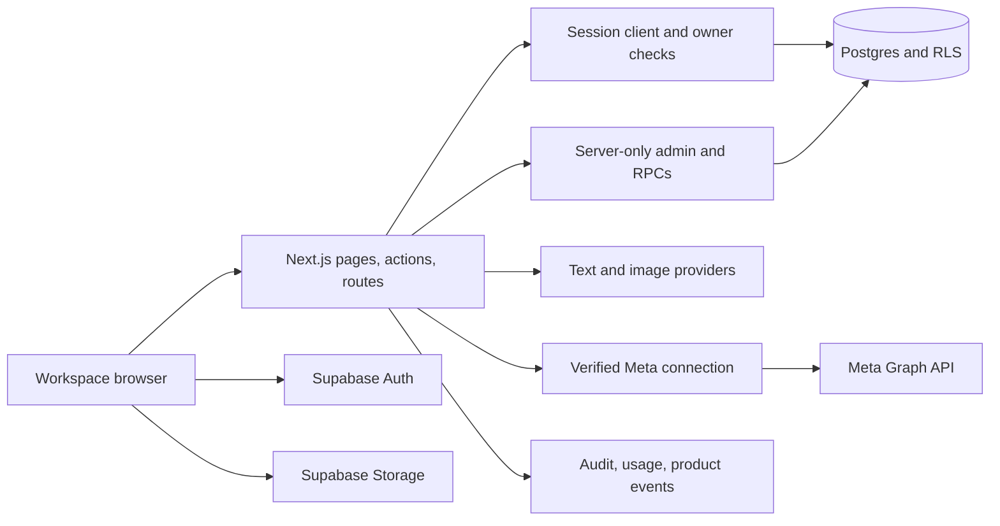
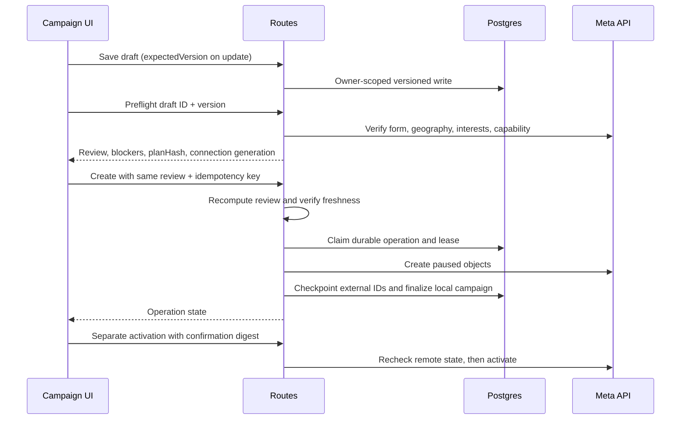

# Architecture

Use this guide to locate the owner of a request, diagnose interrupted work, or
change a workflow without bypassing its authorization and persistence checks.
[API Reference](API_REFERENCE.md) owns wire contracts, [Data Model](DATA_MODEL.md)
owns tables/migrations, and [Features](FEATURES.md) owns the customer workflow.

### Source and Release Scope

Reviewed against development commit `672eb132ad57bb3ba31f118afaffddaa878b4923`
on September 26, 2026. The [SDK/query release receipt](qa/ops-environment-2026-09-26.md#o-11-sdk-and-query-release)
records production commit `6291dc2d2691bfc8a235b2aa1b103f119b26b83e`.
These are deliberately different baselines:

| Layer | What this guide can establish |
| --- | --- |
| Released SDK/query integration | AI SDK adapters and the scoped TanStack campaign-list hook shipped in PR #36; the receipt describes the bounded deployed checks |
| Current development source | Includes DB integrity/trusted-write changes and test-payment work excluded from that release; source presence does not establish applied production migrations |
| Enquiry candidates | [#34 / PR #37](https://github.com/vanshulgoyal101/adbrain/pull/37) adds resumable import; [#35 / PR #38](https://github.com/vanshulgoyal101/adbrain/pull/38) adds saved follow-up/listing. Neither is part of this baseline or the cited production release |

Use [Meta Connection](META_CONNECT.md#lead-import-and-follow-up) for the candidate
boundary and concrete migration handoff. Documentation is not deployment approval.

## System Overview

The browser is untrusted. RLS protects tenant queries; admin operations require
explicit owner checks and constrained RPCs. Not all writes pass through API
routes: brand assets and other browser Supabase interactions rely on Storage/DB
policies. Route instrumentation therefore is not a complete mutation ledger.

## Repository Map

| Location | Responsibility |
| --- | --- |
| [app](../src/app/) | Public pages, authenticated `(app)` pages, auth completion, API handlers |
| [components](../src/components/) | Interactive workspace and shared UI primitives |
| [proxy](../src/proxy.ts) | Session refresh/request guard entry point |
| [Supabase](../src/lib/supabase/) | Session/admin clients, query ownership and aggregation |
| [creative](../src/lib/creative/) | Interview, guarded generation, design, raster persistence, receipts |
| [LLM](../src/lib/llm/) | Application facade owns routing/key cooldown/cache/accounting; AI SDK adapters own text transport and schema output |
| [image generation](../src/lib/imageGen/) | Provider adapters and bounded raster validation |
| [campaign](../src/lib/campaign/) | Drafts, planner, preflight, operations, targeting, activation, spend, reports |
| [Meta](../src/lib/meta/) | OAuth, encrypted tokens, discovery, capability checks, verified provider access |
| [Meta UI client](../src/lib/meta-connect-ui/) | Typed transport, query-owned campaign display reads, preparation cancellation and browser recovery; not mutation authority |
| [security](../src/lib/security/) | Outbound network policy, shared limits, headers |
| [observability](../src/lib/observability/) | Request context, structured events, post-response persistence |
| [database](../db/) | Fresh schema and incremental migrations |
| [tests](../tests/), [e2e](../e2e/) | Unit/component contracts and browser scenarios |
| [scripts](../scripts/) | Local verification and explicitly guarded operational tools |

Next.js 16 differs from earlier framework versions: read the installed
`node_modules/next/dist/docs/` guidance before changing routing, proxy, or async
request APIs. Route parameters are promises in this codebase. Do not replace
current patterns with older framework recipes without checking them.

## Identity and Tenant Ownership

1. Supabase Auth provides the session; server handlers verify `getUser()` rather
  than treating browser IDs or cached page data as authorization.
2. [Queries](../src/lib/supabase/queries.ts) resolve the primary owned workspace.
  Session-scoped queries still require DB/Storage policies; hidden UI is no policy.
3. [Connection access](../src/lib/meta/connection-access.ts) authenticates ownership
  and issues an opaque branded `AuthorizedBusiness` context. A caller cannot gain
  provider authority by constructing a plain business-ID object.
4. `withMetaConnection` checks authorization, purpose capability, optional expected
  generation/binding, then rereads the token binding before decrypting credentials.
  Pause/delete require the campaign's original binding and generation; they do not
  need an activation capability, but still need management permission.
5. Admin clients bypass RLS. Each trusted-write/RPC boundary must therefore enforce
  its own actor, tenant and concurrency conditions. Development DB-A callers depend
  on their corresponding migration grants/functions being installed.

The development identity fallback is intentionally separate from real API auth.
Global Meta environment credentials do not authorize a customer's publishing
action. A business ID supplied by a client is never proof of ownership.

## Creative Data Flow

Brand + active instructions + goal/history -> bounded interview -> editable
brief -> per-angle concept/copy and image generation -> raster/design persistence
-> draft creative rows -> explicit approval.

The [text facade](../src/lib/llm/index.ts) keeps provider selection, key rotation,
cache policy and usage accounting outside the SDK. The
[SDK adapter](../src/lib/llm/providers/sdk.ts) performs one physical text attempt
with SDK retries disabled. Image generation remains a separate adapter boundary;
installing a text SDK does not route raster generation through it.

Each saved variant is independent. `variant_group` connects a client-known UUID
to recoverable rows. [Studio](../src/components/studio.tsx) persists that identity
before POST and reconciles GET results before offering a fresh attempt. Late
responses may clear only their matching pending identity. This is recovery of
saved results, not a durable generation queue, cross-tab admission lock, or
once-only paid execution guarantee. Regeneration resets approval. See
[AI Pipeline](AI_PIPELINE.md#variant-generation) for partial results and costs.

## Campaign Data Flow

Three independent concurrency values matter:

| Value | Guards against |
| --- | --- |
| Draft `version` | Another tab editing saved inputs |
| Connection `generation` | Assets/token authorization changing during work |
| Review `planHash` | Targeting resolution, creative content, selected assets, or budget changing since review |

The creation `idempotencyKey` identifies the same intended operation. It cannot
be reused for different inputs. Database claim/checkpoint/finish RPCs arbitrate
competing workers. A transmitted/uncertain Meta write becomes
`needs_reconciliation`, not an automatic replay. External-ID checkpoints are
important even when a local campaign row has not been finalized.

Activation has its own digest and live verification; creation permission never
implies permission to spend. Budget checks use the total daily commitment across
ad sets. Targeting failures block rather than silently broaden the audience.

## Consistency Boundaries

### Campaign Execution and Read Models

Campaign creation orchestration lives in
[create-service](../src/lib/campaign/create-service.ts), independent of HTTP.
The create route authenticates and verifies the reviewed request; the operation
repository owns claims/checkpoints; the Meta adapter owns provider payloads.
In opt-in worker mode, the route enqueues and returns 202. The standalone worker
rechecks current ownership, draft version, review hash and connection generation
before calling the same service. No Meta creation step is moved to a browser task
or an unawaited Vercel promise. All creation remains PAUSED.

The existing `campaign_operations` ledger is also the queue. Service-only RPCs
claim pending rows with `FOR UPDATE SKIP LOCKED`; expired running jobs require
reconciliation rather than automatic mutation replay. See
[Operations](OPERATIONS.md#campaign-worker-rollout) for leases and deployment.
Inline execution remains the default compatibility mode until that rollout.

Campaign display reads use stable `(created_at,id)` cursors, owner-scoped filters,
and at most 50 rows. Reports/spend checks use complete keyset reads and fail on
any page error; they do not reuse the display page. Complete reads still scale
linearly and are not a transactionally consistent financial ledger. The dashboard
is a server component and still computes its queue from complete campaign data.

Destination is explicit on campaigns and result snapshots: `instant_form`,
`whatsapp`, `call`, `mixed`, or `unknown`. Unavailable conversation metrics are
not zero leads; mixed/unknown/call outcomes are excluded from lead comparisons.
Legacy fallbacks use saved creation evidence, conversation metrics, or the old
app-specific `leads` objective, not arbitrary Meta engagement objectives.

### Campaign List Cache

[useCampaignList](../src/lib/meta-connect-ui/use-campaign-list.ts) owns display
reads through TanStack Query, not campaign mutations. Each mounted view creates
its own `QueryClient`, seeded from server-provided rows; there is no global
cross-owner SSR cache. Keys contain owner, business, trimmed search and status.
Those keys isolate presentation state; the list route still authorizes every read.

- The query function passes its `AbortSignal` to fetch and checks it after JSON
  parsing. Old exact keys are removed on scope/filter changes; unmount clears the
  client. Pages deduplicate by campaign ID and merge stored result snapshots.
- Nonempty search settles after 250 ms; changing status settles the current search
  immediately. Freshness is 30 seconds and cache GC is 60 seconds. Retries,
  mount/focus/reconnect refetch and polling are disabled explicitly.
- Append reads require another cursor and no current fetch. Explicit reload
  cancels the active key, reduces cached pages to the first page, then refetches.
- Mutation-result setters cancel stale reads, patch cached display data, and
  invalidate the owner/business scope. The existing mutation handlers retain their
  confirmation, ownership, provider and persistence responsibilities.

Do not reuse this bounded display cache for complete spend/report calculations.
[Preparation](../src/lib/meta-connect-ui/use-campaign-preparation.ts) and
[targeting conversion](../src/lib/campaign/editor-targeting.ts) remain separate
owners. This is not an application-wide query or editor state-machine rewrite.

| Boundary | Failure mode | Recovery principle |
| --- | --- | --- |
| Browser -> generation | HTTP ends after some paid work | GET by generation ID before new POST |
| Browser -> draft | Stale version | Reload/merge intentionally; do not overwrite |
| App -> Meta creation | Response lost after provider mutation | Query operation; reconcile external IDs |
| Meta -> local campaign mirror | Provider succeeded, DB failed | Verify remote state, preserve evidence |
| Storage -> database | File uploaded but row save failed | Best-effort cleanup; no distributed transaction |
| Usage/event sink | Persistence unavailable | Preserve business result; report health; never rerun paid work merely to log it |
| Candidate #34 lead import | Later provider page or checkpoint fails | Keep committed pages; resume recorded cursor with owner/binding and version checks |

Not every endpoint uses one response envelope or one status mapping. New connection,
draft, preflight, and operation APIs use typed envelopes; older routes retain
plain JSON or download responses. Clients must use the actual contract.

## Security and Resource Bounds

Outbound URL handling rejects unsafe addresses and revalidates redirects, with
DNS-bound connection handling to reduce rebinding risk. Remote media has byte,
pixel, format, frame, and time limits before use. The compositor receives validated
inline rasters rather than arbitrary remote URLs. RLS is still necessary even
when UI controls hide actions.

Paid routes use an atomic shared database rate limiter. Production fails closed
if enforcement is unavailable; nonproduction can fall back to process memory.
Monthly usage is a separate non-atomic quota preflight. Neither mechanism is a
provider billing limit. See [Operations](OPERATIONS.md).

Meta tokens live encrypted in a private schema and are accessed through server-only
RPCs. Browser DTOs contain selected assets/capabilities, never tokens. OAuth uses
signed state, browser binding, expiry, replay protection, and selection revisions.
These controls protect the app boundary; they do not prove Meta has approved the
app or granted usable access to a particular customer's assets.

## Background and Observability

Vercel invokes authenticated daily keepalive and spend-enforcement routes. These
are bounded HTTP jobs, not a persistent worker fleet. UI polling and post-response
`after` tasks do not constitute durable queues.

The opt-in [campaign worker](../scripts/campaign-worker.ts) is a separate persistent
process, not a Vercel cron route. Its source is present; durable hosting, health
checks and alert ownership must be established before enabling it. Do not start
it merely to validate these docs: it can execute real campaign operations.

Owner audit history, trusted AI usage, and structured product events are separate
stores. Product telemetry uses request-local async context and safe metadata;
database logging is opt-in after migration and best effort. See
[Observability](OBSERVABILITY.md) for exact limits and privacy. Logs are evidence
for diagnosis, not proof that every side effect was durably recorded.

## Where to Make Changes

- A new campaign input generally touches the draft schema, planner conversion,
  UI persistence, preflight hash, execution adapter, and regression tests.
- A new provider belongs behind the existing text/image interfaces; document
  credentials, reference support, deadlines, cost reporting, and fallback behavior.
- A new table needs explicit privileges/RLS, fresh-schema and upgrade parity,
  typed rows, and disposable database tests.
- A new route needs ownership, runtime input validation, resource limits,
  response-contract documentation, telemetry privacy review, and failure tests.
- A changed user workflow needs loading, empty, partial, failure, retry, and
  ambiguous-result behavior, not only the successful path.

Keep deployment policy in [Release Workflow](RELEASING.md). Do not infer that all
uncommitted work in a shared checkout is ready to publish together.

For verification, start with [connection access tests](../tests/meta-connection-access.test.ts),
[Studio recovery tests](../tests/studio.test.tsx), and the owning module's existing
suite; [Testing](TESTING.md) owns execution commands and environment isolation.
The [worker receipts](qa/) distinguish author checks from independent acceptance.
