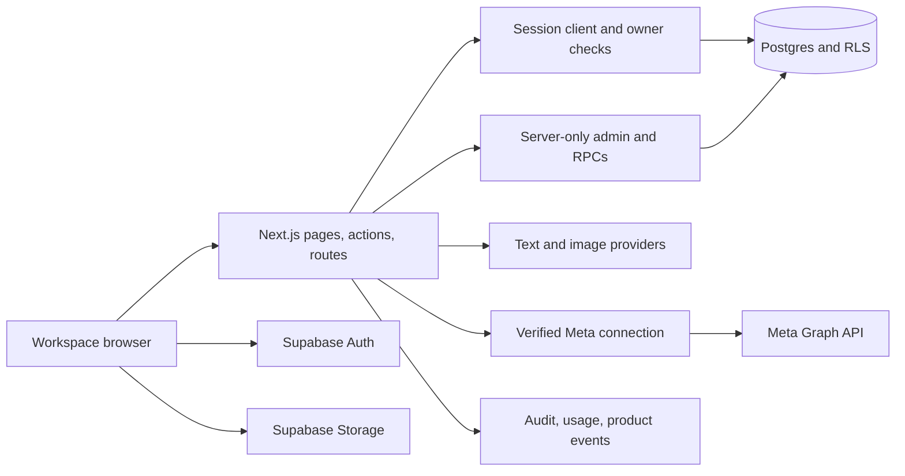
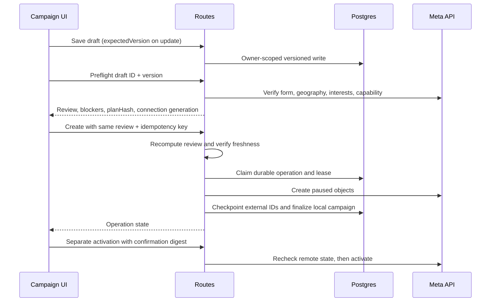

# Architecture

This guide explains current code boundaries. Use [API Reference](API_REFERENCE.md)
for request contracts, [Data Model](DATA_MODEL.md) for persistence, and
[Features](FEATURES.md) for user workflows. Source baseline reviewed 2026-09-18;
deployment is tracked separately in release receipts.

## System Overview

The browser is untrusted. RLS protects tenant queries; admin operations require
explicit owner checks and constrained RPCs. Not all writes pass through API
routes: brand assets and other browser Supabase interactions rely on Storage/DB
policies. Route instrumentation therefore is not a complete mutation ledger.

## Repository Map

| Location | Responsibility |
| --- | --- |
| [app](../src/app/) | Public pages, authenticated `(app)` pages, auth completion, API handlers |
| [components](../src/components/) | Interactive workspace and shared UI primitives |
| [proxy](../src/proxy.ts) | Session refresh/request guard entry point |
| [Supabase](../src/lib/supabase/) | Session/admin clients, query ownership and aggregation |
| [creative](../src/lib/creative/) | Interview, guarded generation, design, raster persistence, receipts |
| [LLM](../src/lib/llm/) | Routing, keys, cache, parsing, usage accounting |
| [image generation](../src/lib/imageGen/) | Provider adapters and bounded raster validation |
| [campaign](../src/lib/campaign/) | Drafts, planner, preflight, operations, targeting, activation, spend, reports |
| [Meta](../src/lib/meta/) | OAuth, encrypted tokens, discovery, capability checks, verified provider access |
| [Meta UI client](../src/lib/meta-connect-ui/) | Typed API transport and browser workflow recovery |
| [security](../src/lib/security/) | Outbound network policy, shared limits, headers |
| [observability](../src/lib/observability/) | Request context, structured events, post-response persistence |
| [database](../db/) | Fresh schema and incremental migrations |
| [tests](../tests/), [e2e](../e2e/) | Unit/component contracts and browser scenarios |
| [scripts](../scripts/) | Local verification and explicitly guarded operational tools |

Next.js 16 differs from earlier framework versions: read the installed
`node_modules/next/dist/docs/` guidance before changing routing, proxy, or async
request APIs. Route parameters are promises in this codebase. Do not replace
current patterns with older framework recipes without checking them.

## Identity and Tenant Ownership

1. Supabase Auth issues the session; server routes verify `getUser()`.
2. Most pages resolve the oldest owned business as the primary workspace.
3. Ordinary reads/writes use session clients and `owns_business` RLS.
4. Meta access first calls `requireOwnedBusiness`, returning an authorized context.
5. `withMetaConnection` checks connection state, purpose-specific capability,
   selected account/Page binding, and expected generation before creating a client.

The development identity fallback is intentionally separate from real API auth.
Global Meta environment credentials do not authorize a customer's publishing
action. A business ID supplied by a client is never proof of ownership.

## Creative Data Flow

Brand + active instructions + goal/history -> bounded interview -> editable
brief -> per-angle concept/copy and image generation -> raster/design persistence
-> draft creative rows -> explicit approval.

Each saved variant is independent. A batch can partially succeed. `variant_group`
links a client-known generation UUID to rows so GET reconciliation can recover
completed work after an HTTP disconnect. There is no durable server generation
queue or unique once-only charge guarantee. Regeneration overwrites one creative
and resets approval. See [AI Pipeline](AI_PIPELINE.md).

## Campaign Data Flow

Three independent concurrency values matter:

| Value | Guards against |
| --- | --- |
| Draft `version` | Another tab editing saved inputs |
| Connection `generation` | Assets/token authorization changing during work |
| Review `planHash` | Targeting resolution, creative content, selected assets, or budget changing since review |

The creation `idempotencyKey` identifies the same intended operation. It cannot
be reused for different inputs. Database claim/checkpoint/finish RPCs arbitrate
competing workers. A transmitted/uncertain Meta write becomes
`needs_reconciliation`, not an automatic replay. External-ID checkpoints are
important even when a local campaign row has not been finalized.

Activation has its own digest and live verification; creation permission never
implies permission to spend. Budget checks use the total daily commitment across
ad sets. Targeting failures block rather than silently broaden the audience.

## Consistency Boundaries

### Campaign Execution and Read Models

Campaign creation orchestration lives in
[create-service](../src/lib/campaign/create-service.ts), independent of HTTP.
The create route authenticates and verifies the reviewed request; the operation
repository owns claims/checkpoints; the Meta adapter owns provider payloads.
In opt-in worker mode, the route enqueues and returns 202. The standalone worker
rechecks current ownership, draft version, review hash and connection generation
before calling the same service. No Meta creation step is moved to a browser task
or an unawaited Vercel promise. All creation remains PAUSED.

The existing `campaign_operations` ledger is also the queue. Service-only RPCs
claim pending rows with `FOR UPDATE SKIP LOCKED`; expired running jobs require
reconciliation rather than automatic mutation replay. See
[Operations](OPERATIONS.md#campaign-worker-rollout) for leases and deployment.
Inline execution remains the default compatibility mode until that rollout.

Campaign display reads use stable `(created_at,id)` cursors, owner-scoped filters,
and at most 50 rows. Reports/spend checks use complete keyset reads and fail on
any page error; they do not reuse the display page. Complete reads still scale
linearly and are not a transactionally consistent financial ledger. The dashboard
is a server component and still computes its queue from complete campaign data.

Destination is explicit on campaigns and result snapshots: `instant_form`,
`whatsapp`, `call`, `mixed`, or `unknown`. Unavailable conversation metrics are
not zero leads; mixed/unknown/call outcomes are excluded from lead comparisons.
Legacy fallbacks use saved creation evidence, conversation metrics, or the old
app-specific `leads` objective, not arbitrary Meta engagement objectives.

Editor preparation cancellation, list requests, and targeting conversion have
separate owners in `meta-connect-ui` hooks and `campaign/editor-targeting`.
The composer is still sizeable; this change does not claim a complete editor
state-machine rewrite or an application-wide scalability certification.

| Boundary | Failure mode | Recovery principle |
| --- | --- | --- |
| Browser -> generation | HTTP ends after some paid work | GET by generation ID before new POST |
| Browser -> draft | Stale version | Reload/merge intentionally; do not overwrite |
| App -> Meta creation | Response lost after provider mutation | Query operation; reconcile external IDs |
| Meta -> local campaign mirror | Provider succeeded, DB failed | Verify remote state, preserve evidence |
| Storage -> database | File uploaded but row save failed | Best-effort cleanup; no distributed transaction |
| Usage/event sink | Persistence unavailable | Preserve business result; report health; never rerun paid work merely to log it |

Not every endpoint uses one response envelope or one status mapping. New connection,
draft, preflight, and operation APIs use typed envelopes; older routes retain
plain JSON or download responses. Clients must use the actual contract.

## Security and Resource Bounds

Outbound URL handling rejects unsafe addresses and revalidates redirects, with
DNS-bound connection handling to reduce rebinding risk. Remote media has byte,
pixel, format, frame, and time limits before use. The compositor receives validated
inline rasters rather than arbitrary remote URLs. RLS is still necessary even
when UI controls hide actions.

Paid routes use an atomic shared database rate limiter. Production fails closed
if enforcement is unavailable; nonproduction can fall back to process memory.
Monthly usage is a separate non-atomic quota preflight. Neither mechanism is a
provider billing limit. See [Operations](OPERATIONS.md).

Meta tokens live encrypted in a private schema and are accessed through server-only
RPCs. Browser DTOs contain selected assets/capabilities, never tokens. OAuth uses
signed state, browser binding, expiry, replay protection, and selection revisions.

## Background and Observability

Vercel invokes authenticated daily keepalive and spend-enforcement routes. These
are bounded HTTP jobs, not a persistent worker fleet. UI polling and post-response
`after` tasks do not constitute durable queues.

The opt-in campaign worker is a separate persistent process, not a Vercel cron
route. Its source is present locally; hosting, health checks and alert ownership
must be established before enabling it on an environment.

Owner audit history, trusted AI usage, and structured product events are separate
stores. Product telemetry uses request-local async context and safe metadata;
database logging is opt-in after migration and best effort. See
[Observability](OBSERVABILITY.md) for exact limits and privacy. Logs are evidence
for diagnosis, not proof that every side effect was durably recorded.

## Where to Make Changes

- A new campaign input generally touches the draft schema, planner conversion,
  UI persistence, preflight hash, execution adapter, and regression tests.
- A new provider belongs behind the existing text/image interfaces; document
  credentials, reference support, deadlines, cost reporting, and fallback behavior.
- A new table needs explicit privileges/RLS, fresh-schema and upgrade parity,
  typed rows, and disposable database tests.
- A new route needs ownership, runtime input validation, resource limits,
  response-contract documentation, telemetry privacy review, and failure tests.
- A changed user workflow needs loading, empty, partial, failure, retry, and
  ambiguous-result behavior, not only the successful path.

Keep deployment policy in [Release Workflow](RELEASING.md). Do not infer that all
uncommitted work in a shared checkout is ready to publish together.
