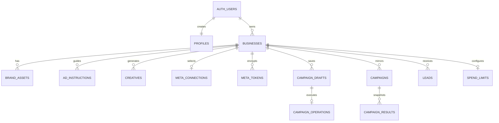

# Data Model and Migrations

Use this reference to identify persisted state, tenant authority and migration
dependencies before changing a caller. Source baseline is dev
`672eb132ad57bb3ba31f118afaffddaa878b4923`, not the production schema. See the
[availability map](FEATURES.md#source-and-availability) and
[release evidence](qa/ops-environment-2026-09-26.md#o-11-sdk-and-query-release).

[db/schema.sql](../db/schema.sql) defines the core fresh schema; incremental and
optional changes live in [db/migrations](../db/migrations/). Not every optional
payment migration is included in the core schema. [TypeScript rows](../src/lib/types.ts)
are hand-authored, not proof of parity. SQL constraints, effective grants, runtime
validation and the target's applied migrations must agree.

## Relationships

The diagram is conceptual: consult SQL for nullable relationships and delete
actions. In particular, campaign `creative_ids` is a UUID array, **not a set of
foreign keys**. Deleting a creative does not automatically rewrite campaign arrays
or remote ads. The primary-workspace query selects the oldest owned business;
there is no database uniqueness constraint limiting an owner to one business.

### Effective Authority

In this dev source, authenticated owners can read their campaign/result/audit
rows, but cannot directly insert, update or delete them. Trusted campaign callers
use server authority only after owner/binding checks. Business delete/truncate is
revoked from browser roles to prevent cascading away retained evidence.

Audit insertion goes through service-only `append_verified_audit_event`; direct
service-role audit mutation is also revoked. The RPC verifies the business owner
or an explicit `cron`/`worker` system identity, assigns the actor label/time and
sets `authority=server`. Existing rows remain `legacy_unverified`. This is verified
write provenance, not cryptographic tamper-proof storage.

Draft owners retain select/insert, but updates/deletes use version-checked RPCs.
The insert trigger establishes owner/version/expiry rather than trusting supplied
authority fields. Read grants do not grant a public API permission to act on a
different owner. RLS and table/function grants both apply: an older policy named
`all own` is not evidence of effective write access after a revoke.

These changes require the September 26 trusted-write and draft-authority
migrations plus compatible callers. They were excluded from the recorded SDK/query
production release. Sources: [trusted writes](../db/migrations/20260926_trusted_campaign_writes.sql)
and [draft authority](../db/migrations/20260926_draft_authority.sql).

## Table Dictionary

### Identity and Brand

| Table | Important fields and semantics |
| --- | --- |
| `public.profiles` | Auth-user UUID primary key, email, created timestamp; signup trigger creates profile |
| `public.businesses` | UUID, owner UUID, name, free-text vertical default `local business`; website/description/voice/audience; primary/secondary colors, font, logo URL; language/location/USP/offer arrays; phone/email/address; timestamps |
| `public.brand_assets` | Business UUID, `type` = `logo`/`product_photo`/`past_ad`, URL, optional notes, creation time |
| `public.ad_instructions` | Business UUID, title, Markdown content, active flag, timestamps; active files supply prompt context |

Blank optional form strings become null; list fields split on newlines, not
commas, preserving locations such as `Jaipur, Rajasthan`. Business name is required.
Email validation permits up to 254 characters, phone permits 7-15 digits with
common separators, website allows a bare domain or HTTP(S) URL, and logo requires
an absolute HTTP(S) URL. These validators do not prove a remote resource is public
or safe; outbound fetch policy is separate. Profile fields do not all have strict
database length bounds; prompt builders truncate selected fields independently.

### Creative and Campaign Data

| Table | Important fields and semantics |
| --- | --- |
| `public.creatives` | Business, brief, angle, headline, primary text, CTA, image URL, `variant_group` UUID, status `draft`/`approved`, optional `generation` JSON, timestamps |
| `public.campaigns` | Business, name, objective, total daily budget, status `draft`/`active`/`paused`/`completed`, creative UUID array, Meta campaign/adset/ad IDs, account/Page/generation binding, raw metadata, launch/create times |
| `public.campaign_results` | Campaign FK, impressions/clicks/leads, spend, nullable CPL, nullable conversations/cost-per-conversation, destination/period, fetch timestamp; ownership follows campaign -> business |
| `public.campaign_drafts` | Business/owner, version >= 1, input JSON, expiry, creation/update times; composite unique `(business_id,id)` |
| `public.campaign_operations` | Business/draft/version/generation, kind `campaign_create`, idempotency key, request hash, state/phase, lease, attempt count, payload/result/external IDs, sanitized error, timestamps |

Creative receipt JSON records generation settings and provenance; it is not a
provider credential store. `variant_group` is indexed, not unique: a generation
UUID groups rows but does not prevent duplicate paid POSTs.

Campaign uniqueness is `(business_id, meta_campaign_id)` for non-null Meta IDs.
Two businesses can deliberately mirror the same external campaign. Never merge
or deduplicate across tenants based solely on a Meta ID. Daily budget is numeric
in SQL while new API inputs are whole rupees; synced historical values can differ.

Operation identity is unique on `(business_id,kind,idempotency_key)` and on
`draft_id`. One draft cannot quietly spawn unrelated operations under new keys.
States: `pending`, `running`, `succeeded`, `failed`, `needs_reconciliation`.
Phases: `campaign`, `adset`, `creative`, `ad`, `reconcile`, `complete`.
Draft FK deletion is restricted while an operation references it; campaign FK
deletion sets operation `campaign_id` null while retaining recovery evidence.

Reporting migrations add `destination` to campaigns and snapshots with a constrained
set of `instant_form`, `whatsapp`, `call`, `mixed`, `unknown` (default).
Snapshot `period_start`/`period_end` record provider dates when available; legacy
rows remain null. No historical range or destination is invented. A snapshot's
known destination wins over the campaign's current destination; unknown snapshots
can fall back to current/legacy evidence, so historical reclassification is not exact.
These fields do not make the spend cap a calendar-week accounting system.
Campaign lists use an index on `(business_id,created_at desc,id desc)`.

Worker jobs use existing operation rows with `payload.execution='worker'` and a
validated reviewed request. A partial pending index supports queue claims. No
second job table can diverge from the operation's idempotency and recovery state.
`private.schema_migrations` records approved named migrations and SHA-256 checksums;
it is administrator-only and does not retroactively catalog earlier deployments.

### Connections and Secrets

| Table | Important fields and access |
| --- | --- |
| `private.meta_tokens` | Business/authorizer/subject; token kind `user`/`business_system_user`/`page`; ciphertext, 12-byte nonce, 16-byte tag, key ID/format version; granted scopes/assets; expiration, validation, revocation timestamps |
| `private.meta_connection_attempts` | Business/user/token reference; unique state hash, browser-binding hash, status, intent, expected generation, revision, discovered assets/completeness, error code, claim/expiry/create timestamps |
| `public.meta_connections` | One row per business; selected Meta business/account/Page, names, currency/timezone, token reference, authorization state, capability JSON, selection reason, generation and check/update times |

The composite `(business_id,token_id)` FK prevents a connection from referring to
another tenant's token row. Private tables deny direct browser access and even
direct service-role table operations; narrowly granted security-definer RPCs
mediate token/attempt access. Connection metadata is served through authorized
server DTOs, not unrestricted client reads.

Legacy `meta_credentials` may exist in upgraded installations and in compatibility
types/migrations. It is not the current publishing credential source. Do not
backfill binding IDs from global environment settings or expose legacy token
columns to restore an obsolete UI.

### Leads, Limits, and Evidence

| Table | Important fields and guarantees |
| --- | --- |
| `public.leads` | Business, nullable campaign, unique `(business_id,meta_lead_id)`, form ID/name, normalized name/phone/email/city, field JSON, provider creation time and import time |
| `public.spend_limits` | One per business; nullable integer weekly cap, alert percentage 1-100 default 80, auto-pause default false, updated time |
| `public.audit_log` | Business/actor, action, entity type/ID, Meta object ID, reason, detail JSON, timestamp |
| `public.llm_usage_events` | Business/user/request, route, text/image kind, provider/model, tokens, estimated USD, prompt version, character counts, temperature/max tokens, cache/latency/attempt/status/error, image dimensions, metadata, timestamp |
| `public.rate_limit_hits` | Limiter key and hit timestamp, indexed by both |
| `public.product_events` | Event/request UUIDs, version 1, optional user/business, kind/name/outcome/duration, allowlisted attributes, timestamp |

Leads use duplicate-ignore inserts, so later provider edits do not update an
existing lead. Campaign deletion sets lead `campaign_id` null rather than deleting
the enquiry. Contact data remains personal data; do not put it in telemetry.

The API and September 26 integrity SQL require a positive integer spend cap or
null. Integrity constraints also reject negative/nonfinite campaign budgets and
costs, unsafe metric counts and invalid reporting periods. Composite foreign keys
bind lead/operation campaigns and operation drafts to the same business. Deleting
a campaign clears the reference, not the lead's business or enquiry record.

Upgrade checks/FKs are initially `NOT VALID`: new writes are constrained but
historical rows are not certified. The separate validation migration must follow
the [read-only preflight](../db/preflight/20260926_campaign_integrity.sql) and any
explicitly approved repair. Neither a passing API request nor applying a constraint
proves old data is clean. These constraints do not establish a spend ledger.

Audit rows are owner-readable, not owner-insertable after trusted-write migration.
Inspect `authority` before treating historical rows as server evidence. Database
administrators remain privileged. Legacy details can contain brief text; newer
product-event privacy rules do not retroactively sanitize that store.

Usage inserts are service-only; owners can select their own rows. The nonnegative
constraint is added `NOT VALID` for upgrade compatibility: new writes are checked,
but old data requires a separate validation decision. Monthly aggregation is
owner-scoped and sums all relevant rows, avoiding client pagination truncation.
Persistence is best effort and estimated costs are not invoices.

Product events are server-only (no browser read/write policy), with bounded JSON
attributes and a 90-day retention target. Pruning deletes at most 10000 old rows
per call. See [Observability](OBSERVABILITY.md) for exceptions and retention backlog.

### Optional Payment Storage

These migration-defined tables are not all part of the core fresh schema and do
not implement live collection, allocation, Meta funding or activation authority.
[Payment Plan](PAYMENTS-PLAN.md) owns commercial readiness and remaining gaps.

| Table | Persistence / authority |
| --- | --- |
| `public.meta_billing_profiles` | Business/environment/billing identity; owner-readable, service select/insert; restricted parent deletion |
| `public.meta_funding_evidence` | Append-oriented verified funding evidence with validation trigger; service-only reads/inserts |
| `public.meta_funding_revocations` | Separate revocation record; service select/insert, no rewriting original evidence |
| `public.meta_billing_events` | Provider charge observations, not an account balance; service read and RPC-mediated writes |
| `public.meta_billing_event_conflicts` | Conflicting event evidence retained separately through the same RPC boundary |
| `private.razorpay_test_orders` | Fixed-amount INR test orders; business/user/merchant/key scope, idempotency identity and provider order mapping |
| `private.razorpay_test_events` | Deduplicated test payment observations; not journal postings or spendable credit |
| `private.schema_migrations` | Administrator-only named migration/checksum ledger created by the migration runner |

Test order/event tables deny direct operations even to service_role; only narrowly
granted `razorpay_test_order_*` RPCs expose them. Test order states are `creating`,
`created`, `captured`, `needs_reconciliation`. Capture does not imply Meta funding
or settlement. Runtime also requires explicitly enabled local test configuration;
installing tables does not enable checkout. See [test API](API_REFERENCE.md#local-test-payments).

### Enquiry Candidate Schema

These changes are absent from baseline dev and the recorded production release:

- [#34 migration at 363859f](https://github.com/vanshulgoyal101/adbrain/blob/363859fc1195839822f60a92fda6109194a14268/db/migrations/20260926_lead_sync_progress.sql)
  adds `public.lead_sync_runs` and service-only sync RPCs. Durable checkpoints
  bind the business/current connection; atomic deduplication and progress commits
  prevent skipped imports on failed/stale page writes. Browser roles cannot
  supply authoritative progress. Existing source, campaign and follow-up fields
  are preserved on repeated import.
- [#35 migration at 6732027](https://github.com/vanshulgoyal101/adbrain/blob/67320272380429b003b2131bf3b2b22641b0dd67/db/migrations/20260926_lead_follow_up.sql)
  adds `leads.workflow_status` (default `new`, constrained to five workflow states)
  and `follow_up_note` (default empty, <=2000 characters), inbox/status indexes and
  `get_lead_page`. The RPC is security-invoker, explicitly owner-checked, granted
  to authenticated only, with RLS still applying. Existing rows get defaults,
  not rewritten provider source fields.

The page RPC returns rows, an exact filtered total and a keyset position. The
server wraps the cursor with business/filter/sort scope. Microsecond timestamp
keys, C-collated name ordering, nulls last and UUID tie-breakers give deterministic
continuation, not a frozen snapshot under concurrent edits. Follow-up PATCH is
restricted to status/note and does not change attribution or send outreach.
See [candidate API](API_REFERENCE.md#enquiry-candidates).

Apply neither candidate automatically. Combined schema assembly, joined import/
follow-up acceptance and any production migration remain separate gates. Do not
copy candidate TypeScript types into an unmigrated database and assume parity.

## RPC Ownership Boundaries

| RPC family | Purpose |
| --- | --- |
| `owns_business` | Current authenticated owner predicate |
| `meta_token_*` | Business-bound encrypted token insertion/read/delete |
| `meta_attempt_*` | OAuth claim, discovery, revision, selection commit and failure transitions |
| `meta_disconnect`, `meta_revoke_subject` | Disconnect/revoke and invalidate connection generation |
| `update_campaign_draft_if_version`, `delete_campaign_draft_if_version` | Authenticated owner/version-checked changes; direct update/delete revoked |
| `append_verified_audit_event` | Service-only verified actor/time/provenance insertion; no browser or direct service table writes |
| `claim_campaign_operation` | Durable idempotency/lease claim |
| `enqueue_campaign_operation`, `claim_next_campaign_job` | Service-only durable enqueue and exclusive pending-job claim |
| `checkpoint_campaign_operation` | Fenced phase and external-ID persistence |
| `finish_campaign_operation`, `fail_campaign_operation`, `expire_campaign_operation` | Terminal/reconciliation transitions |
| `monthly_token_usage` | Security-invoker, owner-RLS monthly sum |
| `check_rate_limit` | Service-only advisory-lock-protected count and insert |
| `prune_product_events` | Service-only bounded retention cleanup |
| `meta_funding_latest_record` | Service-only business/environment-scoped funding evidence lookup |
| `meta_billing_event_record`, `meta_billing_charge_observations` | Service-only verified event/conflict persistence and observation lookup |
| `razorpay_test_order_claim/result/get/find/observe` | Service-only RPC family for isolated test creation/recovery and verified observations |

Do not expose service RPCs as arbitrary browser-callable utilities. SQL grants and
application owner checks serve different purposes and both must remain intact.
See [database tests](../scripts/check-meta-connect-db.mjs) before changing fences.

## Storage

Both `brand-assets` and `creatives` buckets are configured **public**. Object
management is scoped by an owned business UUID as the first path segment, but a
public delivery URL is not a private authenticated download. Do not upload
confidential documents, lead lists, credentials, or unconsented personal media.

Generated media uses `<businessId>/<variantGroup>/<name>-<randomUUID>.png` after
raster normalization. The brand-upload UI accepts PNG/JPEG/WebP up to 5 MiB;
this is a UI guard, not proof of server-wide bucket validation. The shared
server image pipeline has different 20 MiB/40-million-pixel limits.

Deleting a database row does not automatically remove a Storage object. Creative
deletion currently removes the row, not a complete media-retention graph. Brand
asset deletion explicitly coordinates row/reference/file operations but cannot
make them atomic. Cleanup must check campaign/draft/operation references and
retain recovery evidence; never remove media based only on a missing current UI
thumbnail.

## Migration Map

Apply only missing, reviewed migrations for the verified target. Filename order
alone is not a safe deployment plan.

| Migration | Scope / prerequisite |
| --- | --- |
| [001_harden_meta_credentials.sql](../db/migrations/001_harden_meta_credentials.sql) | Historical legacy credential privilege hardening; inspect applicability to existing legacy table/readers |
| [20260906_creative_generation.sql](../db/migrations/20260906_creative_generation.sql) | Creative generation receipts and usage persistence |
| [20260907_meta_instant_connect.sql](../db/migrations/20260907_meta_instant_connect.sql) | Private token/attempt storage, connection metadata and RPCs |
| [20260907_campaign_connect.sql](../db/migrations/20260907_campaign_connect.sql) | Requires connection schema; drafts, durable operations, campaign bindings and fences |
| [20260916_trusted_usage_and_rate_limits.sql](../db/migrations/20260916_trusted_usage_and_rate_limits.sql) | Trusted usage privileges, quota aggregate, atomic shared limiter |
| [20260918_product_events.sql](../db/migrations/20260918_product_events.sql) | Structured event table/retention; enable database logging only after application |
| [20260918_whatsapp_results.sql](../db/migrations/20260918_whatsapp_results.sql) | Nullable conversation metrics; required before callers write WhatsApp results |
| [20260919_campaign_reporting_identity.sql](../db/migrations/20260919_campaign_reporting_identity.sql) | Destination/period identity and campaign-list index; preserve unknown historical values |
| [20260919_campaign_worker.sql](../db/migrations/20260919_campaign_worker.sql) | Requires campaign operations; service enqueue/claim RPCs before worker-mode callers |
| [20260924_managed_billing.sql](../db/migrations/20260924_managed_billing.sql) | Optional billing profiles/evidence/revocations; core business/auth prerequisites |
| [20260924_meta_billing_events.sql](../db/migrations/20260924_meta_billing_events.sql) | Optional observation/conflict storage; managed billing first |
| [20260926_campaign_integrity.sql](../db/migrations/20260926_campaign_integrity.sql) | Requires connection/operations, WhatsApp metrics and reporting identity; new-write checks and tenant FKs, historical data not yet validated |
| [20260926_draft_authority.sql](../db/migrations/20260926_draft_authority.sql) | Requires draft/operation schema; trigger/RPC-only update/delete plus compatible callers |
| [20260926_trusted_campaign_writes.sql](../db/migrations/20260926_trusted_campaign_writes.sql) | Trusted campaign/result callers and verified audit RPC must deploy together with grant changes |
| [20260926_validate_campaign_integrity.sql](../db/migrations/20260926_validate_campaign_integrity.sql) | Separate validation only after integrity migration, read-only preflight and approved repair; failure must not be bypassed |
| [20260926_razorpay_test_orders.sql](../db/migrations/20260926_razorpay_test_orders.sql) | Optional private test orders/events and service RPCs; never live-payment activation |

This inventory is not a command to replay every file. Start an empty local core
database with its documented schema path; do not then blindly reapply non-idempotent
incremental migrations already represented there. For an upgrade, Meta connection
must precede campaign connection; WhatsApp/reporting must precede integrity checks;
managed billing precedes billing events; integrity validation is last after review.
Candidate enquiry migrations are linked separately above, not available files in
this source tree.

The [migration runner](../scripts/database-migrations.mjs) requires explicit target
configuration, serializes named migrations with an advisory lock, records a
SHA-256 checksum and rejects modified already-applied files. The ledger does not
retroactively discover historical deployments or substitute for migration approval.

For each upgrade: inventory deployed objects and grants, review existing data,
test fresh/repeated-upgrade/concurrency paths locally, prepare backup and code
compatibility, get remote-migration authorization, apply transactionally as
appropriate, verify grants/RPCs, and reload PostgREST schema cache if needed.
An additive migration can still change permissions and break old code.

Code rollback does not reverse database writes or decrypt tokens with a different
key. Preserve encrypted-key access, operation history, and existing binding facts.
There is no general automated destructive down-migration workflow. Follow
[Release Workflow](RELEASING.md) for environment changes.