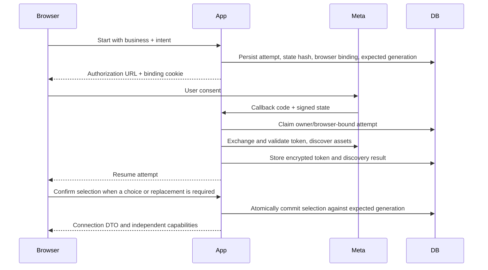

# Meta Connection and Publishing

Use this guide to connect an owner's existing Meta assets, return to saved work,
and recover without repeating an uncertain mutation. AdBrain binds each local
business to one selected ad account and Facebook Page. AdBrain login and Meta
consent are separate: matching email addresses do not establish asset access.
[API Reference](API_REFERENCE.md) owns exact request bodies.

Source reviewed September 26, 2026 at development
`672eb132ad57bb3ba31f118afaffddaa878b4923`. The
[latest cited release](qa/ops-environment-2026-09-26.md#o-11-sdk-and-query-release)
is production `6291dc2d2691bfc8a235b2aa1b103f119b26b83e`, not the entire dev tree.
Development trusted-write callers require their DB-A migrations; the #34/#35
enquiry changes described below are separate candidates, not deployed behavior.
No real consent, lead download or activation was performed for this documentation.

## Prerequisites

- A real authenticated owner of the local business.
- Correct Meta app ID, secret, optional Login for Business configuration ID for
   the configured login flow, and exact callback URL `/api/meta/oauth/callback`
   on the configured site origin.
- Stable server-only token encryption key, service-role access, and applied
  connection/campaign migrations.
- Appropriate Meta roles, asset tasks, permissions, account state, and billing.
- Rollout permission: `enabled` allows users, `pilot` matches the configured user
  UUID, `disabled` denies, and unset permits only non-production. Unknown values
  fail closed. Read/pause/delete access to existing bound campaigns is treated
  separately from opening new publishing access.

Do not populate global `META_SYSTEM_USER_TOKEN`, `META_AD_ACCOUNT_ID`, or
`META_PAGE_ID` and assume a tenant is connected. Current publishing resolves the
business-bound encrypted credential. Public customer access also depends on Meta's
external review process; see [Approval Readiness](META_APPROVAL_ACTION_PLAN.md).

Before asking the owner to reconnect, check [pilot access](../src/lib/meta/pilot-access.ts),
[configuration](CONFIGURATION.md), and the actual target's migrations. Reconnection
does not repair a missing database function or an incompatible encryption key.
Never copy production environment files into a local test to bypass setup work.

## Attempt Lifecycle



An attempt expires after ten minutes. Status is one of `authorizing`,
`discovering`, `selection_required`, `action_required`, `connected`, `cancelled`,
`expired`, or `failed`. Expiry is a validity boundary, not a promise that a worker
will finish the attempt. The browser binding is HttpOnly, SameSite=Lax and secure
in production; a copied callback URL is not a reusable connection grant.

The persisted intent is `setup`, `prepare_campaign` with draft/version, or
`review_activation` with campaign ID. It describes where to resume, not permission
to activate or spend on callback. Consent cancellation leaves the existing
business connection intact rather than guessing another asset pair.

Discovery follows bounded pagination; account and Page listing stop after at most
20 pages each. An incomplete discovery result cannot be treated as a complete list
for silent selection. Candidates and their pair IDs are server-issued; submitting
arbitrary account/Page IDs through the retired connect route is not supported.

After complete discovery, the selection policy retains an eligible existing pair
or automatically links the sole eligible pair. Multiple eligible pairs require a
choice; none leads to guided setup. Eligibility requires an active account,
verified account/Page relationship, supported currency, timezone and Page tasks.
Automatic linking still does not create or activate a campaign; replacement and
generation fences apply when committing the connection.

Selection uses the current attempt revision and explicit replacement confirmation.
An obsolete revision or changed business generation returns conflict. Reload the
attempt/status and review again; do not overwrite newer choices. Retry is for
retryable `failed`/`action_required` attempts with their current revision. Expired
attempts require a new authorization flow.

The deciding modules are [OAuth and token inspection](../src/lib/meta/oauth.ts),
[callback](../src/app/api/meta/oauth/callback/route.ts),
[selection](../src/lib/meta/selection.ts), and
[connection repository](../src/lib/meta/connection-repository.ts).
Discovery's next-page helper validates Meta Graph URLs; do not confuse that
existing mechanism with #34's opaque lead cursors. They are different read paths.

| What the owner sees | Next action |
| --- | --- |
| Consent denied/cancelled | Return to the saved draft; reconnect only when the owner chooses |
| Several eligible pairs | Choose the server-issued pair, then confirm replacement if requested |
| No eligible pair after complete discovery | Inspect account status, Page tasks, currency/timezone and relationship; complete setup in Meta |
| Incomplete discovery or a retryable provider failure | Retry the saved attempt with its current revision; do not infer that assets are absent |
| Expired attempt | Start fresh authorization; an expired revision cannot be revived |
| Selection conflict | Reload current attempt/connection and review the newer binding |

## Four Independent Capabilities

Each capability is `available`, `blocked`, or `unknown`, with structured blockers
and recovery actions. Unknown is not permission. Status is a stored snapshot;
recheck can refresh provider evidence but does not itself create a campaign.

| Capability | Current verification |
| --- | --- |
| `canReadInsights` | Successful insight probe and granted `ads_read` or `ads_management` |
| `canReadLeads` | Page-token form probe plus `leads_retrieval` and `pages_read_engagement` |
| `canCreatePaused` | Matching active account, INR currency, matching timezone, account and Page `ADVERTISE`/`MANAGE` tasks, `ads_management` and `pages_manage_ads` |
| `canActivate` | Create requirements plus verified funding-source ID |

The verifier uses bounded 15-second requests and settles probes independently.
Permission lookup failure leaves capabilities unknown. Its task lookup reads up
to 200 Pages in that probe; a large account can require investigation rather than
assuming absent evidence means the user has no Page. Meta permissions, Graph
version behavior, and account restrictions can change outside AdBrain.

[Capability verification](../src/lib/meta/capability-verification.ts) currently
uses Graph v21.0. A successful forms probe is not a download of every lead; a
funding-source ID is not proof of sufficient balance, a mandate, or automated
funding feasibility. `canActivate` also does not establish approval of the ad
creative, delivery eligibility forever, or a provider-enforced spending ceiling.

Recovery actions are `reconnect`, `retry_check`, `choose_assets`, `contact_admin`,
or `open_meta` with a validated HTTPS destination. Account/billing changes happen
in Meta; the current workflow does not automatically provision accounts or forms.

## Token Security

[Token storage](../src/lib/meta/token-store.ts) uses AES-256-GCM, a fresh 12-byte
nonce and 16-byte tag. The base64 environment key must decode to 32 bytes.
Authenticated additional data binds ciphertext to `v1:tokenId:businessId`, so
moving it to another row/business cannot decrypt successfully. Key ID is currently
`meta-token-v1`; this is not an implemented multi-key rotation service.

Private token/attempt tables are accessed through narrowly granted RPCs. Browser
responses contain connection DTOs, never token material. Access checks reject
revoked, expired, or data-access-expired credentials and re-read the connection
before executing to detect concurrent changes. Keep keys out of logs and never
paste a token into a support ticket.

Changing the encryption key without migration makes existing ciphertext unreadable.
Plan an authorized decrypt/re-encrypt or owner reauthorization process; preserve
the old key in approved secret storage until rollback/recovery is complete.

[Connection access](../src/lib/meta/connection-access.ts) is the provider boundary:
`requireOwnedBusiness` establishes the actor, and `withMetaConnection` enforces
the requested purpose. Read/pause/delete exemptions from publishing rollout do
not bypass ownership, token validity or required campaign binding. Never use the
legacy global-credential helper as a fallback for a failed tenant check.

## From Draft to Campaign

1. Save manual/guided intent. Incomplete drafts are allowed; saving does not
   create Meta objects. Drafts last seven days and edits increment version.
2. Resolve geography/interests and select approved, accessible creatives plus an
   active lead form. No implicit nationwide or WhatsApp-to-form substitution.
3. Request preflight for the exact draft/version. Review account/Page, form,
   audience, content, per-ad-set budget, ad-set count, and total daily budget.
4. Submit the review hash, connection generation, and a stable idempotency key.
   The server repeats preflight and rejects changed inputs before mutation.
5. Poll or look up the durable operation. It checkpoints external IDs and creates
   the local campaign only after the external sequence completes successfully.
6. Inspect the paused result. Activation is a separate confirmed action with a
   fresh capability/binding/spend check and confirmation digest.

For example, INR 300 per day with the two-ad-set option is INR 600 total per day,
not INR 300 shared. The option splits age bands; it is not a Meta Experiments
randomized A/B testing integration. Actual remote billing remains controlled by Meta.

Draft version, attempt revision, connection generation, review hash, activation
digest, and idempotency key are different controls. Never substitute one for
another or recompute server hashes in an integration. See [Architecture](ARCHITECTURE.md).

[Create service](../src/lib/campaign/create-service.ts) and
[operation orchestration](../src/lib/campaign/operations.ts) own the durable
creation path. An optional [worker](../src/lib/campaign/worker.ts) uses the same
service; it is not enabled merely by deploying a cron route. Account, campaign,
ad-set and ad evidence must remain available when local finalization fails.

[Activation PATCH](../src/app/api/campaigns/[id]/route.ts) separately verifies
stored spend inputs, generation, digest, capability and remote campaign budget
before requesting ACTIVE. It then saves the local status. This is **not** an
atomic transaction with Meta, and the creation idempotency key does not turn
activation into a durable once-only operation. Concurrent spend checks are not
atomic budget reservations. After an ambiguous activation or failed local save,
verify remote status and local binding before another action; do not infer that
an error means delivery never started. [Operations](OPERATIONS.md) owns incident
procedures and [Release Policy](RELEASING.md) owns authorization for live changes.

## Lead Import and Follow-Up

The supported import scope is accessible instant-form enquiries on the selected
Page, not WhatsApp conversations, call logs, arbitrary Pages or every historical
Meta contact. `read_leads` authorization remains mandatory.

| Source | Actual behavior and limit |
| --- | --- |
| Reviewed dev baseline | [Meta client](../src/lib/meta/client.ts) returns one form page and one page per form; [sync route](../src/app/api/leads/sync/route.ts) batches three form reads and saves their combined rows. This can miss page two; it is not complete/resumable import |
| [#34 / PR #37](https://github.com/vanshulgoyal101/adbrain/pull/37), `363859fc1195839822f60a92fda6109194a14268` | Validated page methods, opaque cursors, per-page atomic insert/checkpoint, owner/binding checks and version fencing. Candidate implementation; independent/combined acceptance remains separate |
| [#35 / PR #38](https://github.com/vanshulgoyal101/adbrain/pull/38) | Paginated saved inbox and owner-managed follow-up candidate. Dev owns its guide/data contract and combined schema; do not assume the sync response is the whole inbox |

In #34, empty POST starts or recovers unfinished work for the current binding.
To resume exactly, the synthetic body shape is:

```json
{"syncId":"11111111-1111-4111-8111-111111111111"}
```

This POST reads real provider data and writes local rows when real credentials
are configured; it is not an offline diagnostic. Existing `leads`, `imported`
and `failedForms` fields remain; `sync` adds `{id,state,hasMore}`. `imported`
means verified inserts during this request, not fetched or cumulative rows.
`partial`/`hasMore: true` means recorded continuation, never "up to date".
The response's at-most-200 saved leads are only a compatibility snapshot.

Candidate limits: 24 form/lead page calls per request, 200 items per page, three
concurrent lead reads, 40-second provider deadline and three-second checkpoint/
snapshot timeouts. Legacy array helpers stop with an error after 100 pages.
Successful pages commit before progress advances. Malformed/repeated cursors and
later failures preserve prior saves; failed forms remain queued while others can
proceed. No `paging.next` URL is followed or saved for lead continuation. Duplicate
imports leave owner follow-up and existing source/campaign fields untouched;
campaign attribution is not guessed from form names.

Foreign/missing runs are rejected; changed binding/generation or stale writers
require conflict recovery. After a changed binding, an empty POST can begin a
fresh run. An inaccessible form may remain partial until permissions are repaired;
`hasMore` is not a promise that Meta will continue serving that cursor forever.

### Candidate Migration and Handoff

The exact [#34 migration](https://github.com/vanshulgoyal101/adbrain/blob/363859fc1195839822f60a92fda6109194a14268/db/migrations/20260926_lead_sync_progress.sql)
adds `lead_sync_runs`, `lead_sync_start` and `lead_sync_checkpoint` with
service-only grants. Apply after existing business/Meta/leads tables and before
deploying the candidate route; it is absent from this documentation base.
Dev owns incorporation into combined `db/schema.sql`, alongside #35's separate
follow-up migration. The [concrete handoff](https://github.com/vanshulgoyal101/adbrain/issues/35#issuecomment-5846838850)
already supplies the migration and additive sync types; documentation work does
not authorize applying it. An application rollback may retain the additive table.

#34 author evidence is 216 focused/affected tests and separate fresh/upgrade
PostgreSQL checks, including competing writers and cross-business rejection.
Its interrupted/resumed route run uses synthetic provider/checkpoint fixtures;
the SQL transaction tests use real disposable Postgres. Neither is a live Meta
download or combined #34/#35 customer acceptance.

## Recovery and Destructive Actions

| Situation | Safe action |
| --- | --- |
| Browser loses create response | Look up the original idempotency key/operation before retrying |
| `running` with a live lease | Poll; a conflicting create does not mean it failed |
| `needs_reconciliation` | Preserve all external IDs and inspect Meta/local state; do not issue a new-key create |
| Connection changed after review | Reopen the draft/review against the new generation |
| Campaign binding differs | Do not rewrite account/Page fields to bypass safety checks |
| Capability unknown | Recheck; investigate provider/permission evidence if persistent |
| Wrong account selected | Confirm intended replacement; existing campaigns retain their original binding |
| Disconnect requested | Confirm the business; existing remote campaigns are **not paused or deleted** |
| Meta deauthorization | Signed callback revokes matching subject credentials; owner must reauthorize |
| Baseline inbox seems complete after sync | Do not claim completeness from a first-page import; #34 remains a separately reviewed candidate |
| #34 returns partial or uncertain save/read | Keep the known sync ID and saved rows; retry/reconcile rather than clearing the inbox |

Pause/delete are delivery-reducing operations, but still require original binding,
connection generation, and management permission. Manual mutation routes verify
remote binding. Do not assume the scheduled enforcement path performs every same
remote check; it relies on stored binding and current connection fences.

Deletion confirms the Meta operation before deleting the local mirror; external
success and local persistence are not a distributed transaction. Sync imports
supported ACTIVE/PAUSED campaigns page by page, reports skips, and does not prune
all local rows absent from a page. Use [Operations](OPERATIONS.md) for incidents.

For local contract evidence, see [access tests](../tests/meta-connection-access.test.ts),
[activation route tests](../tests/meta-connect-w2-activation-route.test.ts), and
the [historical connection verification](meta-connect-workers/VERIFICATION-2026-09-07.md).
That historical receipt explicitly distinguishes mocked consent from real
customer authorization. External review readiness is tracked separately in
[Meta Approval Readiness](META_APPROVAL_ACTION_PLAN.md).