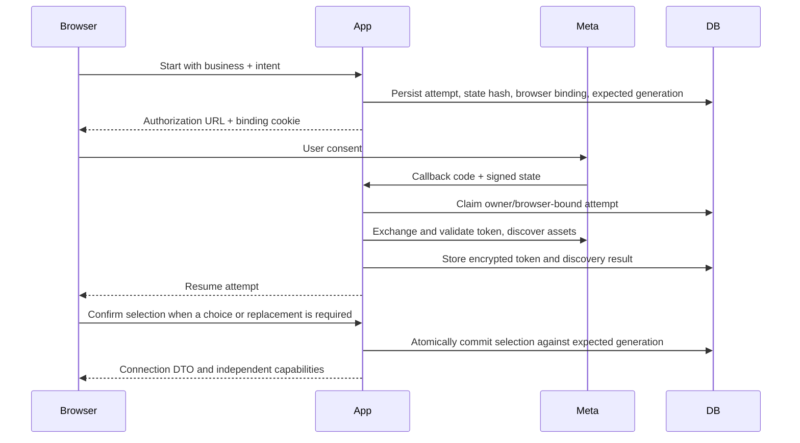

# Meta Connection and Publishing

AdBrain binds each local business to one selected Meta ad account and Facebook
Page. Application login and Meta authorization are separate. A Google login to
AdBrain does not grant access to Facebook assets, and matching email addresses
do not establish ownership. See [API Reference](API_REFERENCE.md) for exact bodies.

## Prerequisites

- A real authenticated owner of the local business.
- Correct Meta app ID, secret, optional Login for Business configuration ID for
   the configured login flow, and exact callback URL `/api/meta/oauth/callback`
   on the configured site origin.
- Stable server-only token encryption key, service-role access, and applied
  connection/campaign migrations.
- Appropriate Meta roles, asset tasks, permissions, account state, and billing.
- Rollout permission: `enabled` allows users, `pilot` matches the configured user
  UUID, `disabled` denies, and unset permits only non-production. Unknown values
  fail closed. Read/pause/delete access to existing bound campaigns is treated
  separately from opening new publishing access.

Do not populate global `META_SYSTEM_USER_TOKEN`, `META_AD_ACCOUNT_ID`, or
`META_PAGE_ID` and assume a tenant is connected. Current publishing resolves the
business-bound encrypted credential. Public customer access also depends on Meta's
external review process; see [Approval Readiness](META_APPROVAL_ACTION_PLAN.md).

## Attempt Lifecycle

An attempt expires after ten minutes. Status is one of `authorizing`,
`discovering`, `selection_required`, `action_required`, `connected`, `cancelled`,
`expired`, or `failed`. Expiry is a validity boundary, not a promise that a worker
will finish the attempt. The browser binding is HttpOnly, SameSite=Lax and secure
in production; a copied callback URL is not a reusable connection grant.

The persisted intent is `setup`, `prepare_campaign` with draft/version, or
`review_activation` with campaign ID. It describes where to resume, not permission
to activate or spend on callback. Consent cancellation leaves the existing
business connection intact rather than guessing another asset pair.

Discovery follows bounded pagination; account and Page listing stop after at most
20 pages each. An incomplete discovery result cannot be treated as a complete list
for silent selection. Candidates and their pair IDs are server-issued; submitting
arbitrary account/Page IDs through the retired connect route is not supported.

After complete discovery, the selection policy retains an eligible existing pair
or automatically links the sole eligible pair. Multiple eligible pairs require a
choice; none leads to guided setup. Eligibility requires an active account,
verified account/Page relationship, supported currency, timezone and Page tasks.
Automatic linking still does not create or activate a campaign; replacement and
generation fences apply when committing the connection.

Selection uses the current attempt revision and explicit replacement confirmation.
An obsolete revision or changed business generation returns conflict. Reload the
attempt/status and review again; do not overwrite newer choices. Retry is for
retryable `failed`/`action_required` attempts with their current revision. Expired
attempts require a new authorization flow.

## Four Independent Capabilities

Each capability is `available`, `blocked`, or `unknown`, with structured blockers
and recovery actions. Unknown is not permission. Status is a stored snapshot;
recheck can refresh provider evidence but does not itself create a campaign.

| Capability | Current verification |
| --- | --- |
| `canReadInsights` | Successful insight probe and granted `ads_read` or `ads_management` |
| `canReadLeads` | Page-token form probe plus `leads_retrieval` and `pages_read_engagement` |
| `canCreatePaused` | Matching active account, INR currency, matching timezone, account and Page `ADVERTISE`/`MANAGE` tasks, `ads_management` and `pages_manage_ads` |
| `canActivate` | Create requirements plus verified funding-source ID |

The verifier uses bounded 15-second requests and settles probes independently.
Permission lookup failure leaves capabilities unknown. Its task lookup reads up
to 200 Pages in that probe; a large account can require investigation rather than
assuming absent evidence means the user has no Page. Meta permissions, Graph
version behavior, and account restrictions can change outside AdBrain.

Recovery actions are `reconnect`, `retry_check`, `choose_assets`, `contact_admin`,
or `open_meta` with a validated HTTPS destination. Account/billing changes happen
in Meta; the current workflow does not automatically provision accounts or forms.

## Token Security

[Token storage](../src/lib/meta/token-store.ts) uses AES-256-GCM, a fresh 12-byte
nonce and 16-byte tag. The base64 environment key must decode to 32 bytes.
Authenticated additional data binds ciphertext to `v1:tokenId:businessId`, so
moving it to another row/business cannot decrypt successfully. Key ID is currently
`meta-token-v1`; this is not an implemented multi-key rotation service.

Private token/attempt tables are accessed through narrowly granted RPCs. Browser
responses contain connection DTOs, never token material. Access checks reject
revoked, expired, or data-access-expired credentials and re-read the connection
before executing to detect concurrent changes. Keep keys out of logs and never
paste a token into a support ticket.

Changing the encryption key without migration makes existing ciphertext unreadable.
Plan an authorized decrypt/re-encrypt or owner reauthorization process; preserve
the old key in approved secret storage until rollback/recovery is complete.

## From Draft to Campaign

1. Save manual/guided intent. Incomplete drafts are allowed; saving does not
   create Meta objects. Drafts last seven days and edits increment version.
2. Resolve geography/interests and select approved, accessible creatives plus an
   active lead form. No implicit nationwide or WhatsApp-to-form substitution.
3. Request preflight for the exact draft/version. Review account/Page, form,
   audience, content, per-ad-set budget, ad-set count, and total daily budget.
4. Submit the review hash, connection generation, and a stable idempotency key.
   The server repeats preflight and rejects changed inputs before mutation.
5. Poll or look up the durable operation. It checkpoints external IDs and creates
   the local campaign only after the external sequence completes successfully.
6. Inspect the paused result. Activation is a separate confirmed action with a
   fresh capability/binding/spend check and confirmation digest.

For example, INR 300 per day with the two-ad-set option is INR 600 total per day,
not INR 300 shared. The option splits age bands; it is not a Meta Experiments
randomized A/B testing integration. Actual remote billing remains controlled by Meta.

Draft version, attempt revision, connection generation, review hash, activation
digest, and idempotency key are different controls. Never substitute one for
another or recompute server hashes in an integration. See [Architecture](ARCHITECTURE.md).

## Recovery and Destructive Actions

| Situation | Safe action |
| --- | --- |
| Browser loses create response | Look up the original idempotency key/operation before retrying |
| `running` with a live lease | Poll; a conflicting create does not mean it failed |
| `needs_reconciliation` | Preserve all external IDs and inspect Meta/local state; do not issue a new-key create |
| Connection changed after review | Reopen the draft/review against the new generation |
| Campaign binding differs | Do not rewrite account/Page fields to bypass safety checks |
| Capability unknown | Recheck; investigate provider/permission evidence if persistent |
| Wrong account selected | Confirm intended replacement; existing campaigns retain their original binding |
| Disconnect requested | Confirm the business; existing remote campaigns are **not paused or deleted** |
| Meta deauthorization | Signed callback revokes matching subject credentials; owner must reauthorize |

Pause/delete are delivery-reducing operations, but still require original binding,
connection generation, and management permission. Manual mutation routes verify
remote binding. Do not assume the scheduled enforcement path performs every same
remote check; it relies on stored binding and current connection fences.

Deletion confirms the Meta operation before deleting the local mirror; external
success and local persistence are not a distributed transaction. Sync imports
supported ACTIVE/PAUSED campaigns page by page, reports skips, and does not prune
all local rows absent from a page. Use [Operations](OPERATIONS.md) for incidents.