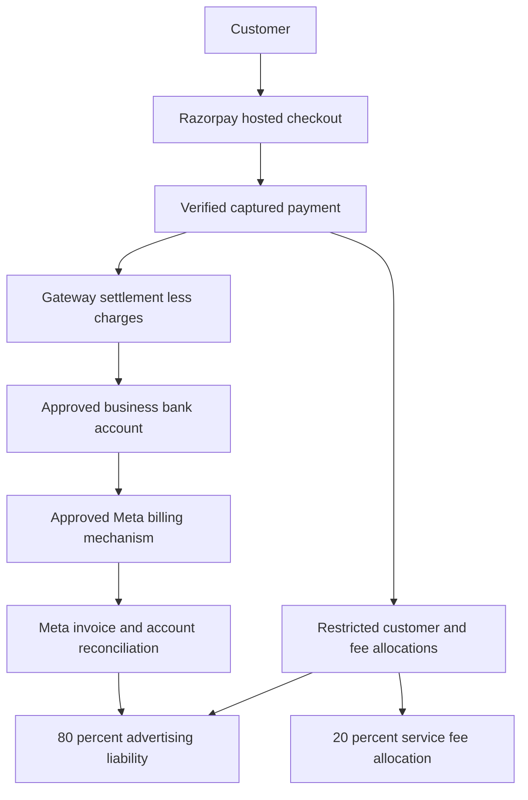
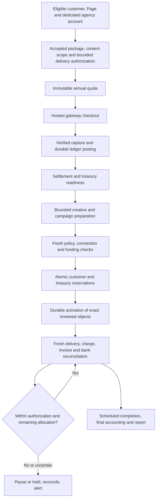

# Customer Payments and Managed Advertising

Status: local test checkout UI/backend and design. Updated: 2026-09-26.
Live payment collection, bank transfers, Meta funding, account creation,
production migrations and deployment remain disabled/unapproved.

Latest operator clarification, September 26: AdBrain is currently operated by
Vanshul Goyal as an unregistered business. Razorpay onboarding uses the owner's
personal merchant identity, and the permitted display name is Vanshul Goyal.
The earlier assumption that Solaride already operates AdBrain is superseded.
A future Solaride arrangement requires formalization, reviewed merchant/bank/tax
details and Razorpay approval; it is not merely a business-type toggle. Existing
Meta account bindings are unchanged. No PAN, phone, bank details or credentials
are recorded here. Solaride ownership/funding plans below are future proposals,
not authorization to collect on Solaride's behalf today.

Earlier September 26 owner decision: before merchant onboarding, start isolated
Razorpay test-mode work in parallel with Meta funding verification. This is a
narrow exception to the funding-first coding order below, not a waiver of any
live launch gate. The current backend and gated Settings checkout are described
in section 9. Two real-provider test captures and an intentional test-bank failure
are now verified; live payments, public webhooks and refunds remain unverified.

The [implementation sequence](#8-delivery-phases-and-acceptance-gates) below is
the detailed build plan requested September 25. It starts from verified repository
foundations and targets unattended normal operation after initial onboarding and
authorization. It does not promise zero provider failures or eliminate exceptional
human intervention, and it does not authorize live financial actions.

## 1. Goal and Decisions

**Highest priority, owner clarification September 25:** a customer pays INR 10,000
for an annual advertising package: INR 2,000 is allocated to AdBrain's service
fee and INR 8,000 covers Meta advertising plus applicable Meta taxes. Net media
is the INR 8,000 less its included taxes, not INR 8,000 of media plus extra tax.
Prove automatic Solaride-to-Meta payment before further campaign preparation,
generic billing infrastructure or checkout implementation. Annual service does
not imply authorization for automatic annual customer renewal.

Confirmed by the owner: India/INR, managed advertising with one customer payment,
20/80 allocation with gateway costs absorbed by AdBrain, and room to change pricing
later. The latest INR 10,000 annual-total example supersedes the earlier assumption
of INR 10,000 plus customer tax. Customer invoice tax treatment and whether the
requested allocations are legally/economically feasible still require CA review;
do not silently increase the payable total or promise INR 2,000 net profit.
A future Solaride operating arrangement is not formalized. Owner-provided Meta
screenshots show Solaride's business portfolio as Verified and an ad-account
creation limit of 3; that is not
proof of unused slots, API permissions or approved agency billing. Solaride 101 is
shown as owned by Solaride with INR currency and no saved payment method. Its
displayed account ID differs from the earlier prepaid billing screenshot, so the
earlier balance must not be attributed to Solaride 101. Actual automated funding
eligibility remains unverified. Razorpay is recommended, not yet onboarded or
provider-approved. No address, tax ID or contact details from screenshots are
needed in this document.

| Decision | Recommendation | Required before live use |
| --- | --- | --- |
| Legal entity | Current operator: Vanshul Goyal's unregistered business; Solaride is a proposed future arrangement | Gateway KYC, settlement account and invoices must match the verified operator; a Solaride transition requires formalization and provider approval |
| Gateway | Razorpay Standard Checkout; evaluate Cashfree if onboarding/use-case approval fails | Merchant KYC, business-model approval, settlement bank verification |
| Pricing | Latest owner target: INR 10,000 annual customer payment, INR 2,000 service allocation, INR 8,000 inclusive of Meta taxes | CA-reviewed customer invoice tax treatment; disclose any necessary change for owner approval rather than adding tax silently |
| Gateway costs | Absorb in AdBrain's economics; never silently subtract from the advertised 80% | Confirm pricing remains viable after fees, fee taxes, refunds and disputes |
| Funds model | Owner-selected: managed advertising service with a restricted customer advertising liability | Gateway and legal review; not an unlicensed wallet or arbitrary money forwarding service |
| Meta assets | Owner-selected: Solaride-owned, separate ad account per customer | Disclose agency ownership, customer access and offboarding terms; verify account capacity and funding eligibility |
| Account provisioning | Optional, eligibility-gated; existing-account connection stays available | App access/permissions, portfolio eligibility, customer consent |
| Initial launch | One annual-package customer payment; Meta charges Solaride automatically through a verified method as funds are needed | Refund/unused-funds policy, annual dates and delivery schedule, reconciliation and capped pilot approval; no automatic customer renewal |

### Example and accounting boundaries

For the requested INR 10,000 annual payment: INR 2,000 service allocation plus
INR 8,000 tax-inclusive Meta cost allocation. If the applicable Meta tax were
18%, the illustrative split would be INR 6,779.66 media plus INR 1,220.34 tax
(`8000 / 1.18`), not an 18% subtraction from INR 8,000. Use the verified invoice
rate and rounding rules in production, not this illustrative rate.
Do not assume GST applies only to the fee: principal/agent treatment, advertising
resale, place of supply, tax registration, withholding and input credits need CA
review. Meta invoice taxes must be accounted for explicitly without double-counting.
The owner has resolved the product meaning of the 80%: tax-inclusive Meta costs.
Customer-facing tax treatment is a separate unresolved question. Existing quote
code uses a pre-tax base and explicit additional tax; it is not yet an annual,
tax-inclusive customer checkout implementation.

20% of the package is a 25% fee relative to its 80% ad allocation. It is not the
same as adding a 20% markup to a customer's chosen advertising budget.

Use integer paise only. Fee = floor(base paise / 5); advertising receives the
remainder. Preserve the versioned quote for all later reconciliation. Gateway
fees are an AdBrain expense, not a change to the original quote. Allocation is
neither earned revenue nor a bank payout: revenue recognition and owner withdrawal
must wait for the agreed service, tax, refund and reserve policy.

### Annual Package and Illustrative Economics

Owner target: INR 10,000 per year with the allocations above. Proposed service
scope, not yet approved: one business, one current offer, one service area, up to
two creative variants and one capped lead campaign with a closing spend/enquiry report. Use
the existing instant-form destination for the first Solaride test unless the
owner explicitly chooses another destination. Campaign duration and media limits
must fit the annual allocation; annual payment does not mean continuous daily
delivery. The paused pilot's INR 200/day setup is not an annual spending plan.
Renewal, unused funds, creative refreshes and campaign scheduling need explicit
terms; no guaranteed enquiries or sales.

The owner confirmed that INR 8,000 includes applicable Meta tax, with net media
and tax itemized. Do not describe it as INR 8,000 delivered media, deduct gateway
fees from it, or enable checkout before CA/gateway approval and funding proof.

Historical pre-tax comparison only, NOT the latest INR 10,000 annual-total offer:
assume 18% customer tax on the full base,
18% Meta tax, and a gateway charge of 2% plus 18% tax on that charge. These are
scenario inputs, not verified tax treatment or a negotiated provider quote.

| INR 10,000 base scenario | Cash amount (INR) |
| --- | ---: |
| Customer total under the illustrative tax assumption | 11,800.00 |
| Service allocation | 2,000.00 |
| Gateway cash cost on the customer total | 278.48 |
| Net media within a tax-inclusive INR 8,000 Meta allocation | 6,779.66 |
| Service cash remaining before delivery costs, with tax-inclusive Meta allocation | 1,721.52 |
| Cash remaining if INR 8,000 net media is promised and Meta tax is funded from the fee | 281.52 |

The comparison excludes input-tax-credit recovery, fixed overhead, refunds and
disputes; it is not an accounting profit calculation. At a proposed 10% of base
cash-contribution target, the tax-inclusive scenario permits at most INR 721.52
of generation, support and other variable delivery costs before reserve expenses.
Measure real operator time and generation cost in the pilot. If those costs exceed
the ceiling, revise package size/scope or propose a new fee version before selling.

Proposed refund principle for review: no ad delivery before cleared funding and
explicit approval; return unspent advertising allocation after final Meta charges
are reconciled, and refund unearned service amounts under disclosed milestones.
Do not promise instant refunds of money already loaded into a Meta account. Exact
milestones, refund timing, dispute handling and gateway terms remain launch gates.

### Changing pricing later

The implementation accepts an explicit versioned server policy in basis points
(20% = 2,000 of 10,000). General fee calculation is
`floor(basePaise * platformFeeBps / 10000)` with exact integer intermediates.
Every quote snapshots its version, rate, allocations, tax and total. Add a new
immutable policy version for a new rate; never edit the meaning of an existing
version or recalculate an accepted order/refund using today's rate. A future
database policy registry must enforce that immutability, activation/effective
time, permitted tenant overrides and privileged audit. Browser clients must not
choose a policy or fee rate. Expired unpaid quotes require explicit repricing
and renewed customer acceptance; paid orders keep their original terms.
Tax-inclusive pricing, tax rules or fee-cost policy changes also require a new
approved quote schema/policy, not just a rate update.

## 2. How Money Actually Moves



Do not implement a fictitious transfer-to-Meta API. Standard gateway settlement
normally reaches the merchant's bank net of charges; our ledger reserves the
advertising share. Paying Meta is a separate approved process via the account's
supported billing method or an approved invoicing/credit arrangement. Its timing
need not match an individual customer's checkout.

Razorpay Route transfers to onboarded Linked Accounts and has eligibility and
use-case requirements. It does not establish that Meta is a supported recipient.
Do not create a linked account using Meta's identity or bank details. Route is
not part of this initial design unless both providers explicitly approve it.

### Supported models to decide between

1. **Customer pays Meta directly:** easiest separation. AdBrain collects only its
   service fee; Meta collects advertising money. This does NOT meet the requested
   single-payment 20/80 flow and requires an explicit product decision.
2. **AdBrain-managed billing:** customer buys an advertising service; AdBrain
   reserves funds and pays Meta through an approved mechanism. Best match for one
   payment, but AdBrain bears settlement timing, chargeback and overspend risks.
   Customer-owned versus agency-owned assets remains a separate decision.
3. **Approved Meta invoicing/credit:** useful later for eligible businesses.
   API credit allocation is not a deposit of gateway funds. Credit eligibility,
   repayment liability and account compatibility must be verified first.

The gateway, bank, and legal reviewer must accept the chosen funds flow before
we collect real money. Do not pool unapproved customer funds or use one customer's
balance to cover another's campaigns. Maintain an operational reserve separately.

### Funding-first implementation priority (owner request)

The owner explicitly reaffirmed funding as the highest priority on September 25.
Resolve the supported outbound funding mechanism first, then implement only the
integration needed for the annual package; defer checkout and further campaign
polishing. New-customer account provisioning is a prerequisite to check alongside
funding, not permission to create accounts or change billing settings now.
The owner explicitly requires automatic money movement; operator-assisted payment
is not an accepted substitute. New customer ad accounts should be Solaride-owned,
one per customer. These requirements supersede the earlier customer-owned account
recommendation and proposed operator-assisted pilot.

Public Meta documentation establishes automatic payment options in India. Support
confirmation is not required merely to establish that these options exist. Actual
bank/recurring-method eligibility and setup still need verification. The September
24 live billing check confirms Solaride 101 uses available funds in INR, making
UPI auto-reload the candidate route. No recurring mandate has been authorised.

| Route | Automatic movement | Remaining prerequisites |
| --- | --- | --- |
| UPI auto-reload | Meta replenishes an available-funds account when its balance reaches the configured threshold | Eligible India account and UPI instrument; one-time authorisation in Meta and the UPI app; verified reload amount, threshold and provider limits |
| Automatic card billing | Meta charges eligible cards at billing thresholds and the monthly bill date | Compatible billing mode and Indian bank/card; RBI-compliant recurring authorisation; settlement float and charge reconciliation |
| Monthly invoicing / credit | Credit allocation supports advertising but is not a cash payment | Meta eligibility, credit approval and a separately verified automatic invoice-payment mechanism; public direct-debit documentation does not establish India support |

#### Immediate Delivery Plan

1. **Select a verifiable payment route.** For new Solaride-owned customer accounts,
   assess eligible automatic postpaid card billing: Meta charges the agency's
   authorized instrument, so no per-customer cash top-up API is necessary. Do not
   assume the existing prepaid Solaride 101 can be converted. For that existing
   account, UPI auto-reload remains a candidate with an unresolved enrollment path;
   do not repeat the one-off QR experiment or generic AI support loop.
2. **Prove setup and limits on one account.** Verify account/bank compatibility,
   agency billing permission, owner-visible mandate terms and amount limits.
   After specific authorization, the owner completes bank authentication directly
   and a bounded real automatic payment is reconciled. One-time setup may be
   required per account/instrument; failed, expired or revoked mandates can need
   human intervention. Account provisioning API access is not payment consent.
3. **Implement the annual service flow against that route.** One verified customer
   capture and settlement, immutable INR 2,000/8,000 allocations and service dates,
   approved tax split, account binding, spend controls, payment-failure stop and
   actual Meta charge/invoice reconciliation. Customer allocation, Meta deposit,
   tax and delivered media remain distinct. Use existing foundations where suitable.
4. **Require proof, not a simulated transfer.** Acceptance is customer payment ->
   correct account's automatic Meta payment -> matched bank/provider evidence,
   within approved limits and without an operator paying each top-up. An API
   `funding_id`, ledger credit or paused campaign does not meet this criterion.

September 25 documentation recheck: the public Ad Account reference identifies
`funding_id` as a payment-method ID and `invoice` as attachment to an existing
credit line, not cash deposit operations. The UPI setup article explicitly requires
Save UPI plus authorization in the external UPI app, followed by reload amount
and threshold settings. No arbitrary prepaid top-up API is established by these
references. A private/partner facility would need explicit Meta approval and docs.

Meta's [India recurring-card documentation](https://www.facebook.com/business/help/3536169639844756)
confirms one-time card verification/authorization and subsequent threshold-based
charges on eligible cards. Prefer an approved agency debit instrument where
available; using a credit card also requires a repayment plan so paying the card
does not become a hidden manual funding step. Its mandate limit is not the
customer's annual allocation. Auto-reload can also leave unused prepaid funds or
deposit beyond the remaining allocation. Verify provider spend controls and
reserve/stop behavior before promising that total Meta costs stay within INR 8,000.

For larger-scale account onboarding, Meta's
[2-Tier Business Manager solution](https://developers.facebook.com/docs/business-management-apis/2tier-bm-solution/)
explicitly supports platforms paying for clients' ads and billing clients before
delivery. Access is limited; its
[prerequisites](https://developers.facebook.com/docs/business-management-apis/2tier-bm-solution/prerequisites)
require a Meta representative and an extended credit line. This is a potential
approved platform route, not an immediately available prepaid-transfer API or
proof of Solaride eligibility. Invoice repayment automation must still be verified.

### Live Solaride billing check: September 24

The owner-authenticated Meta billing page for Solaride 101 (account ending 2052)
showed INR 0.00 available funds, no saved payment method and no recent spending.
The page explicitly says it deducts from available funds as ads run and pauses
ads when funds run out. This confirms the account's billing mode, not recurring
payment eligibility. Meta's displayed daily spending limit is not a customer
allocation cap or an AdBrain-configured account spending limit.

Both payment selectors offer UPI. Add payment method led to an empty Add to balance
amount form. Add funds offered cards, UPI and net banking, and prefilled INR 96,150
as its current maximum. That amount was cleared; it was not an approved top-up.
With UPI selected and the amount empty, no Save UPI checkbox or auto-reload setting
was visible. No amount was submitted during that initial inspection. The balance's
More options menu offered only View history. This does not prove auto-reload is
unavailable: its enrollment may occur later in the funding flow.

The owner subsequently approved entering INR 100 and inspecting the next screen
only, explicitly excluding payment, mandate authorization and ad activation.
The Other amount option and UPI selection were verified before advancing. Meta
accepted INR 100 within its displayed INR 40 to INR 96,150 range and generated an
unpaid, expiring UPI QR payment request. The Complete payment screen offered no
Save UPI or recurring authorization option. No QR was scanned, payment authorized
or bank details entered. The flow was left without paying. A fresh billing reload
confirmed no open payment dialog, INR 0.00, no saved methods and no recent spending.
Closing the dialog is not evidence that the unpaid request was cancelled; it had
an expiry. Do not pay it later under this inspection-only approval.

Next account-specific question for Meta: Solaride 101 is an India/INR available-
funds account, but Add funds > UPI goes directly to a one-off QR request without
Save UPI for recurring charges. Is UPI auto-reload enabled for this account, and
what exact eligibility or enrollment prerequisite is missing? The public setup
article alone does not answer this account-specific discrepancy. Do not fund the
account merely to assume that a recurring option will appear after payment.

The owner clicked Next Step in the support form, which displayed Meta's Beta
Product Testing terms, AI terms and Privacy Policy. After supplying the direct
account URL and selecting Solaride 101 explicitly, a support chat was opened using
the existing contact email, with the optional phone field blank. The assistant
identified itself as automated assistance for the owner and requested guidance
only, with no billing, payment, mandate or ad changes authorized.

The AI-enabled support chat reported that this account is eligible for auto-reload
but needs a saved primary payment method first. That is a support statement, not
observed recurring enrollment or a verified bank mandate. Its follow-up claimed
that an initial payment is required, but also said Save UPI must be selected before
payment and that paying a one-off QR alone likely would not save a recurring method.
It said a card is not required. These statements do not explain the missing option
or establish that a manual top-up will unlock it; do not pay merely to test that
assumption.

Asked to diagnose the discrepancy, the automated support agent said its tools and
documentation could not do so. Human billing escalation was requested, but it said
no specialist was available. It also could not provide a case/reference number or
support-inbox link. It acknowledged the issue as unresolved and said the conversation
is automatically saved; no independently verified escalation ticket was obtained.
The chat remains open for the owner. No payment, mandate or account change was
authorized or performed during the support conversation. The next required evidence
is a usable recurring-UPI enrollment path, or a separately verified compatible
automatic-billing route, not another generic setup article or ordinary top-up.

Meta's [setup instructions](https://www.facebook.com/business/help/791384133101786)
specify Add funds, an amount and UPI, then Save UPI for future recurring charges,
authorization in the external UPI app, followed by reload amount and balance
threshold settings. Inspect further only with an explicitly approved initial
amount and scope. The owner must handle bank authorization directly. Stop if the
flow offers only a one-off payment; a successful manual top-up would not satisfy
the automatic-funding requirement. Do not substitute prepaid card auto-reload,
which Meta's [supported methods](https://www.facebook.com/business/help/333798826401061)
exclude in India.

All five campaign toggles were Off during the same inspection. Two other ad sets
were On beneath Off campaigns. Recheck delivery state immediately before any
authorized funding, leave unpublished drafts untouched, and obtain separate ad
activation approval. No initial deposit, mandate, reload amount or threshold is
approved by the owner's earlier acceptance of the automatic-payment product model.

### Automatic funding boundaries

India UPI auto-reload is distinct from recurring card billing. Meta's prepaid
card auto-reload documentation excludes India; eligible postpaid recurring card
billing is supported. Do not infer that an existing prepaid account can be
converted, or that hybrid billing is available to every account. The local UPI
assessment conservatively requires available-funds mode until hybrid auto-reload
compatibility is separately established. Provider limits and eligible banks can
change; do not hardcode a permanent bank list or transaction ceiling.

**Automatic payments are not an exact 80% checkout transfer.** No documented public
API for arbitrary prepaid deposits or configuring auto-reload was found in the
reviewed references and SDK. That is a research result, not proof that no private
facility exists. `funding_id` selects a funding arrangement, not an amount to send.
Do not automate Ads Manager, store payment credentials/OTP, or invent a gateway
recipient. One-time mandate authorisation is different from repeated manual
top-ups. On 2026-09-24 the owner accepted one-time authorisation followed by
Meta-controlled recurring charges, with AdBrain tracking the customer's allocation.
An exact 80% deposit at checkout is not required under this accepted model. This
product decision does not authorise a bank mandate, payment, account creation or
ad activation. Actual account/method eligibility and authorisation remain gates.
Repeated operator-assisted top-ups remain outside the approved product scope.

**Spending and cash must remain separate.** Available-funds accounts cannot set a
Meta ad-account spending limit. Auto-reload can deposit more than the customer's
remaining allocation and leave unused prepaid funds. Campaign budgets, atomic
ledger reservations, delayed-spend reconciliation and pause monitoring must work
together; none is a promise of a real-time hard cap. Postpaid billing requires
treasury reserves for charges before gateway settlement, taxes, disputes and
refunds. Never assume a credited balance equals available customer entitlement.

For Meta-initiated charges, persist the verified billing configuration and ingest
provider charge/invoice evidence. Record observed charges independently of local
funding requests: Meta can initiate a charge without an AdBrain request. Dedupe by
provider/account/environment/reference, retain pending and ambiguous states, and
reconcile bank settlement, account, currency, taxes and customer attribution. Do
not retry or recreate a Meta-initiated charge from AdBrain. A funding-source ID,
screenshot, browser success flag or balance increase is not settlement evidence.

If a documented AdBrain-initiated payment adapter becomes available later, use
durable requests with `requested`, `approved`, `processing`,
`needs_reconciliation`, `confirmed`, `failed` and `cancelled` states. Reserve funds
atomically before processing, never blindly retry ambiguous outcomes, and release
only on definitive no-transfer failure/cancellation. Reconciliation overrides need
an identified reviewer and evidence, not an API-verified label. Prevent duplicate
reference reuse and concurrent refund/funding/withdrawal against the same money.

Next: select an acceptable route and onboarding model, verify it for an eligible
Solaride-owned account, then implement durable configuration, charge ingestion and
reconciliation in an isolated test environment. Support remains relevant for
limited-access programmes, credit approval or account-specific restrictions, not
as the sole path to researching automatic payments. Keep live actions disabled.

## 3. Can AdBrain Create Ad Accounts?

Yes, conditionally. Meta documents `POST /{business_id}/adaccount`, appropriate
Marketing API access and `business_management` permissions. Account limits,
business standing, asset roles and verification can block creation. Public docs
are not proof that this app/business is eligible. Current AdBrain uses Graph
v21.0 in capability verification; the public reference may display a newer
version. Verify support for the pinned version before implementing or upgrading.

Proposed onboarding:

1. Choose connect-existing or request-new; do not require a new account to pay.
2. Verify the customer's business identity, target portfolio ownership, consent,
   currency INR, timezone and real end advertiser. Show the legal owner clearly.
3. Check app access, granted scopes, administrator/asset roles, business standing
   and remaining creation allowance. Unknown or exhausted capacity blocks automated
   provisioning; an existing eligible account remains a separate connection path.
4. Persist a server-owned provisioning request before any provider mutation.
5. Create only on explicit confirmation. Store returned account ID immediately;
   on timeout/ambiguous response reconcile, never blindly retry a create.
6. Verify customer access, Page permissions and the billing arrangement separately.
   An account ID or `funding_source_details.id` is not proof of a funded balance.
7. Show ready only after account and funding verification. Keep campaigns PAUSED
   until separate activation checks pass. Today, payment does not launch campaigns.
   The planned automated path additionally requires a recorded, bounded customer
   delivery authorization and the financial/execution gates in section 8; payment
   confirmation alone will never authorize activation.

The owner selected Solaride ownership, one account per customer. Agency ownership
needs a clear contract covering access, liability, offboarding and data export;
do not promise ownership transfer is possible. Existing Solaride advertising must
not be mixed with unrelated customers. The displayed creation limit of 3 is a
capacity constraint, not proof of three available slots; check actual allowance
before every request and obtain an approved increase before scaling. Never create
accounts or portfolios to evade restrictions or quotas.
New-account creation is a later provider-gated phase, not a prerequisite we can
promise unconditionally during checkout.

Meta explicitly documents the marketing-partner-owned ad account / customer-owned
Page model. Its two-tier Business Manager solution also describes platforms paying
for client advertising, but is limited-access and requires credit prerequisites.
Neither pattern proves Solaride is enrolled, permits quota evasion or guarantees
unattended payment-method onboarding. Preserve customer Page consent and accurate
end-advertiser identity even where Solaride owns the ad account.

## 4. Repository Integration and Data Design

Existing `src/lib/campaign/spend.ts` evaluates weekly budgets and reporting
snapshots; it is not a cash ledger or prepaid-balance enforcement mechanism.
Keep its protections and add funding checks alongside them. Current Meta
capability verification remains authoritative for permissions, not money.

Data design: billing profiles, funding evidence, revocations and observed charge
events now have local, unapplied migrations. Other tables below remain planned.
No production migration or payment workflow is enabled.

| Table | Purpose and critical constraints |
| --- | --- |
| billing_profiles | Tenant, legal details, invoice identity, approved funds model and tax-policy version |
| payment_orders | Tenant, immutable quote, environment/provider account, unique local idempotency key, unique provider order ID |
| payment_attempts | Unique provider payment ID, expected order binding, captured amount, independent refunds/disputes |
| payment_events | Durable inbox, unique provider/environment/account/event ID, payload hash, processing state |
| ledger_transactions / ledger_entries | Append-only balanced postings, unique business-event key, tenant and currency invariants |
| campaign_funding_reservations | Atomic available-to-reserved movements, campaign/account binding, expiry/release lifecycle |
| payment_refunds | Amount, frozen entitlement, provider refund ID, unique request key, pending/processed/failed state |
| payment_settlements | Provider settlement ID, fees/taxes, adjustments and bank match |
| meta_billing_profiles | Implemented locally: immutable tenant/account/portfolio/environment assignment, one account per customer and one customer per account within an environment; no credentials |
| meta_funding_evidence / meta_funding_revocations | Implemented locally: append-only account-bound setup snapshots, reviewer/source references, verification/expiry and separate irrevocable revocation records; service-only access |
| meta_billing_events / meta_billing_event_conflicts | Implemented locally: immutable charge observations, unique profile/event reference, transactional duplicate detection and durable conflicts; no local transfer request required. Invoice/bank matching remains planned |
| funding_operations | Future documented AdBrain-initiated adapter requests only; separate from observed Meta charges, no synthetic transfers |
| ad_account_provisioning | Consent, target portfolio, dedupe key, returned account ID, ambiguous-outcome handling |

All money fields: checked nonnegative integer minor units unless an explicit
debit/credit entry uses a signed amount. Database totals must also reject overflow.
Tenant read access uses RLS; financial writes and posting RPCs are server-only,
with fixed search paths, least-privilege grants, actor and tenant checks. Derive
tenant/account identity from authenticated ownership, never trusted client notes.
No raw card details, CVV, provider secrets, full webhook PII or tokens in logs.

Ledger example at capture (pre-tax INR 10,000): debit gateway receivable 10,000;
credit customer advertising liability 8,000; credit deferred service fees 2,000.
Tax adds its separately approved liability. Settlement clears the receivable to
bank and gateway expenses. Delivery, revenue recognition, Meta payment and refunds
use separate balanced postings. Reserve/available are customer-liability subledgers,
not additional money. Recognition details require accountant approval.

## 5. Payment Protocol

1. Authenticate, resolve tenant, rate-limit and validate amount limits. Verify the
   approved billing profile and funding route before offering managed checkout.
2. Compute an immutable server quote from an approved tax policy. Client sends
   intent, not fee, tax, allocation, destination account or provider credentials.
3. Persist local intent and idempotency key before creating a Razorpay order with
   partial payments disabled. Do not assume provider order creation is idempotent;
   ambiguous timeouts require reconciliation, not blind creation of another order.
4. Open hosted checkout using server-returned order ID and public key only. CSP
   changes must be narrowly scoped to documented checkout endpoints and tested.
5. Treat browser success as pending verification. Verify callback HMAC against the
   stored order ID, then verify captured payment/order, amount, currency, merchant
   environment and tenant binding server-side. Signature alone grants no balance.
6. Verify webhook signature over raw bytes before JSON parsing. Bound body size,
   durably store the event, then acknowledge. Reject mismatched merchant accounts.
   Use separate test/live secrets; handle rotation without logging secrets.
7. Process captures once in a database transaction with order/payment uniqueness
   and ledger event uniqueness. Event dedupe alone is insufficient because different
   event IDs can describe the same capture. Never credit from authorization alone.
8. Handle duplicates and out-of-order capture/refund/dispute events; independent
   adjustments must not be erased by a late capture event. Persist unmatched events
   for reconciliation rather than inventing a tenant/order from webhook notes.
9. Periodically reconcile gateway API state, local ledger, settlements/bank and
   Meta invoice/spend evidence. Surface mismatches to an operator; fail closed on
   stale/unverified funding. Recovery must survive process restart and replay.

Payment, settlement, funding and campaign activation are distinct states. A paid
order remains paid after a refund in Razorpay; never derive refundable balance
from order status alone. Pending/failed/abandoned checkout has zero spend authority.

## 6. Funding, Activation and Refund Safety

- Atomically reserve funds before activation or any budget increase; concurrent
  requests cannot each spend the same balance. Re-check at execution, including
  resumed worker actions and direct API paths. Never replace existing spend caps.
- Daily budget times seven and delayed Insights totals cannot guarantee a prepaid
  hard cap. Use supported provider-side lifetime/account limits, a delivery-lag
  reserve, verified campaign end times and frequent reconciliation. Quantify the
  residual overspend risk in the pilot; AdBrain needs its own reserve.
- Include campaigns changed directly in Ads Manager; customer access can invalidate
  limits. Detect drift and stop new activation. Failed pauses/unknown provider
  outcomes are incidents, not released reservations.
- Never mark money sent to Meta solely because an internal allocation was made.
  UI distinguishes pending payment, allocated, reserved, delivered and reconciled.
- Refund request freezes the refundable amount atomically. Pause affected delivery,
  reconcile late spend, calculate unused funds and fee entitlement under accepted
  terms, then issue the provider refund. Completion requires provider evidence.
- Full refund before delivery is the recommended initial policy; partial fee
  earning/refunds and tax credit notes need explicit approved rules. No automatic
  promise that spent funds or gateway charges are recoverable from Meta/provider.
- Concurrent refund and activation must serialize. Disputes freeze affected funds
  and restrict activation; do not hide deficits by clamping accounting balances.
- Outbound bank withdrawal of fees requires earned revenue, reconciled cash and
  adequate tax/refund/dispute reserves. Do not automatically sweep 20% at capture.

## 7. Customer and Operator Experience

Customer Billing under the existing workspace: transparent package breakdown,
tax/invoice details, hosted Pay action, pending/retry/recovery states, receipts,
available/reserved/spent ad allocation and refund status. Never call the allocation
a Meta wallet balance. Payment success does not say the campaign is live.

Create/activation: show the required reservation, selected Meta account and a
clear insufficient-funds or funding-unverified result. Existing unpaid/draft
customers are not silently charged or migrated to managed billing. The planned
managed path lets a customer authorize an explicit service scope and spending
ceiling during onboarding, then runs within that scope without routine operator
approval. Material changes outside the authorization require renewed consent.

Operator tools: unreconciled payments, webhook backlog, settlements, outstanding
Meta liability, pending refunds/disputes, funding evidence and provisioning failures.
Sensitive manual adjustments require privileged actor, reason, audit trail and
approval policy; edits to balances are forbidden.

## 8. Delivery Phases and Acceptance Gates

This sequence supersedes the earlier phase table, not the historical evidence
above. It is a plan, not implementation authorization or a delivery-date promise.
The target is one repeatable managed-customer workflow before broader automation.

### 8.1 What We Have Built

Source baseline: `9da5b07` on `dev`; rechecked September 25. Local source and test
evidence are separate from hosted deployment, schema application and provider
approval. See section 9 for the detailed implementation receipt.

| Existing surface | Reuse | Still missing |
| --- | --- | --- |
| [Allocation helper](../src/lib/payments/allocation.ts) | Integer-paise arithmetic, immutable snapshots, versioned fee basis points | Annual package, tax-inclusive payable total, service dates, persisted policy/quote and approved invoice treatment; do not reinterpret v1 |
| [Razorpay verification](../src/lib/payments/razorpay-verification.ts) | Checkout HMAC, raw-webhook HMAC, captured-payment/order/amount checks | Authenticated provider client, durable orders/events, merchant/environment binding, posting and recovery |
| [Funding assessments](../src/lib/payments/meta-funding.ts) | Method catalogue, account/portfolio/mandate/capacity checks, evidence expiry and revocation checks | Verified source collection, supported payment arrangement and permission to execute; existing execution flags always remain false |
| [Charge assessment](../src/lib/payments/meta-billing-events.ts) and [store](../src/lib/payments/meta-funding-store.ts) | Internal observation format, duplicate/conflict handling, fail-closed reads | Real provider adapter, invoice/bank matching, accounting and ongoing collection; the internal event format is not a Meta webhook contract |
| [Billing migration](../db/migrations/20260924_managed_billing.sql) and [event migration](../db/migrations/20260924_meta_billing_events.sql) | Immutable customer/account assignments, evidence/revocations, service-only ingestion | Approved deployment, customer order/ledger/reservation/refund/settlement tables and retention/offboarding design |
| [Managed billing panel](../src/components/managed-billing.tsx) | Existing Settings location and truthful disabled state | Checkout, payment status, invoices, allocation history, refund/cancellation and actionable customer states |
| [Campaign service](../src/lib/campaign/create-service.ts) and [worker](../src/lib/campaign/worker.ts) | Reviewed paused creation, durable claims, checkpoints and ambiguous-outcome handling | Payment readiness, scoped unattended authorization, atomic funds reservation and durable activation/pause recovery |
| [Spend logic](../src/lib/campaign/spend.ts) | Existing weekly commitment checks | Fresh period-aligned spend, annual allocation accounting, tax/lag allowance and provider-side containment |

At the September 25 baseline, the payment execution helpers had no application
callers or checkout/payment webhook routes. Section 9 records the later local
test integration. There is still no customer-money ledger or
automatic bank-to-Meta integration. Settings renders a catalogue, not a connected
live payment service. Existing campaign recovery is useful infrastructure but is not
proof of financial correctness or a running worker deployment.

Focused verification for this plan on September 25: all 248 tests in the five
existing payment test files passed with synthetic fixtures and isolated public
configuration. No real payment, bank, Meta or production database was contacted.

### 8.2 Target Workflow and Automation Boundary



For automatic postpaid billing, Meta charges the authorized agency instrument
after spend reaches its billing conditions; this is not a transfer triggered
by each checkout. For prepaid auto-reload, deposits follow the verified balance
threshold and mandate. Customer allocation, Meta account cash balance, delivered
media, tax, invoice liability and bank settlement remain separate quantities.

Normal operation should require no employee to create each campaign, top up an
account, click through retries or reconcile a spreadsheet. Initial KYC, Page
connection, bank mandate and customer authorization require the relevant person.
Revoked consent, provider restrictions, disputed money and genuinely ambiguous
mutations may require exception handling. Exposing a durable hold with a clear
reason is correct behavior; repeatedly guessing until an action succeeds is not.

The proposed delivery authorization snapshots customer/business, account/Page,
package/version, approved claims/offer, allowed destinations/audiences, total
tax-inclusive Meta-cost ceiling, delivery dates, creative policy and allowed
automatic actions. Customer payment is not that authorization by itself. No
new consent is implied for existing customers or the paused Solaride pilot.
Renewal, broader targeting, changed claims or extra spend require new authority.

### 8.3 Implementation Sequence

| Milestone | Dependency | Concrete outcome | Completion gate |
| --- | --- | --- | --- |
| M0: verify the payment route | First priority | Usable automatic Meta billing, account onboarding and machine-readable reconciliation sources | Account-specific evidence and an explicitly authorized bounded automatic-payment proof; no manual-top-up substitute |
| M1: approve package and contracts | Commercial review can run alongside M0; code after route selection | Annual quote v2, authorization model, accounting/tax/refund rules and isolated test environment | Owner/CA/gateway decisions recorded; INR 10,000 total is not silently changed |
| M2: durable financial core | M0 and M1 | Orders, event inbox, journal, reservations, durable jobs and reconciliation states | Fresh/upgrade DB tests prove conservation, tenant isolation, races and restart safety |
| M3: gateway lifecycle | M2 and approved test merchant access | Hosted checkout, capture, refunds, disputes and settlement matching in test mode | One order reconciles once under duplicate/out-of-order events; capture is not mistaken for bank funds |
| M4: Meta/account integration | M0; financial effects require M2 | Eligible dedicated account binding/provisioning, fresh funding evidence and automated charge/invoice collection | Real authorized sources, safe provisioning recovery and no fabricated money movement |
| M5: unattended delivery | M3, M4 and accepted delivery authorization | Automatically prepare, reserve, activate, monitor, pause and finish a bounded campaign | Financial gates cover every entry point; critical delivery/spend audit defects resolved and tested |
| M6: recovery and customer experience | Built alongside M2-M5; gate before launch | Usable status/invoice/refund screens, exception queue, alerts and reconciliation runbooks | Restart, outage, refund, revoked mandate and stale-spend scenarios have verified outcomes |
| M7: controlled pilot and expansion | All prior gates | One complete automatic customer journey and measured service economics | Separately approved live scope; matched customer/gateway/bank/Meta evidence, outcome report and no unexplained balances |

M0 has real external dependencies. Do not estimate its completion from coding
effort. Once its route and interfaces are proven, implement one milestone at a
time with its acceptance evidence; do not declare unfinished downstream work
released because individual helpers pass unit tests.

### M0: Prove the Route Before Building Around It

Recommendation: assess automatic postpaid agency card billing for new eligible
Solaride-owned customer accounts first. Keep UPI auto-reload as the separate
candidate for the existing available-funds account; do not assume conversion is
possible. Invoicing/credit remains a later eligibility-gated option. Razorpay
Standard Checkout remains the incoming gateway candidate, not a Meta-transfer API.

Produce a short route decision record covering:

1. Exact account/portfolio ownership, INR/India eligibility, actual remaining
    capacity, app/API access and customer Page access. Verify the pinned Graph
    version before selecting account-creation or billing endpoints.
2. Authorized instrument, recurring mandate, charge timing/limits and repayment
    automation if a credit card is used. Keep credentials and bank consent outside
    AdBrain/chat; verify whether setup requires a person per account/instrument.
3. Supported machine-readable sources for charges, invoices/tax, settlement/bank
    evidence, account funding failures and revocations, including identifiers,
    pagination, delay, authentication and permitted polling frequency. A screenshot
    or an operator-maintained CSV cannot be the normal reconciliation mechanism.
4. Provider spending controls and cancellation/late-charge behavior for that exact
    billing mode. Available-funds accounts do not gain an account spending cap by
    adding auto-reload. Quantify potential unused deposits and overspend exposure.
5. A separately approved test scope: exact account, mandate terms, maximum cash
    exposure, stop conditions and evidence to retain. The owner completes bank
    authorization directly. No charge or account creation is authorized by this plan.

Proof means a real automatic charge matched to the correct account and bank or
payment-provider evidence, not a manually paid QR or an internal credit. If the
chosen postpaid method needs actual delivery to trigger billing, stage that proof
as a separately authorized, bounded initial pilot with verified provider controls;
do not manufacture a charge or bypass delivery safety to complete this milestone.
Resolve feasibility before expanding checkout work, even when the final payment
proof must accompany the controlled delivery test.

If automatic account enrollment or adequate evidence collection is unavailable,
record the exact blocker and keep the fully unattended rollout gated. Present
any proposed model change for owner approval; do not quietly replace the selected
single-payment managed service or separate-account requirement.

### M1: Freeze the Annual Contract and Test Boundary

- Introduce a new immutable quote schema/policy version. Preserve the meaning
   of the current pre-tax v1 helper and its tests. Snapshot payable total,
   service/ad allocations, approved customer tax breakdown, Meta tax policy,
   service start/end, delivery schedule, offer scope and expiry of unpaid quotes.
- Retain the owner target of INR 10,000 total, INR 2,000 service and INR 8,000
   tax-inclusive Meta cost. A CA must establish a balanced invoice/accounting
   treatment; tax cannot be added silently or treated as extra nonexistent cash.
   Gateway fees remain an agency expense. The 20% is not automatically earned
   revenue, withdrawable cash or profit.
- Decide service dates, activation delay after settlement, campaign scheduling,
   maximum paid creative work, unused-funds treatment, cancellation, partial fee
   earning, refunds, disputes and renewal. Annual service is not a year-long daily
   ad budget or authority for recurring customer debits.
- Define and record the bounded delivery authorization described above. Keep
   existing explicit campaign approval in force until that new path is implemented
   and approved. Start with one agreed destination/offer, not unrestricted AI spend.
- Verify an isolated Supabase environment and gateway test merchant. Do not load
   production environment files. Test/live namespaces must differ for all orders,
   events, account bindings, jobs and credentials. Meta test fixtures are not a
   provider payment sandbox.

Done when the policy example balances in paise under the approved tax treatment,
expired quotes require renewed acceptance, and the customer terms match the
actual automated service. No checkout until the route and merchant use case pass.

### M2: Build the Smallest Complete Financial Core

Use the table boundaries in section 4; avoid a general-purpose wallet product.
Implement server-owned immutable policy/quote, service-order and authorization
records, a verified event inbox, balanced journal, reservations, refund records
and settlement matches. Add only the job/outbox structure required for reliable
processing; do not overload campaign creation rows with unrelated payment jobs.

Database invariants and transactions:

- All amounts are checked integer paise with currency and environment binding.
   Journal entries balance per transaction; corrections append compensating entries.
   Each capture/refund/charge/settlement effect has a unique business-event key,
   independent of webhook delivery IDs.
- Capture records the obligation and gateway receivable, not bank cash. Settlement
   clears that receivable against net bank credit, gateway fees and adjustments.
   Default launch policy waits for verified settlement and adequate agency cash;
   any launch funded earlier needs a separately approved agency-owned float policy.
- Advertising entitlement moves between mutually exclusive pending, available,
   reserved, incurred and refund/dispute-held buckets. A refund or dispute cannot
   freeze the same paise twice. Atomically check and move the available amount;
   never implement balance checks as a read followed by an independent insert.
- Customer and treasury reservations protect different things: customer entitlement
   versus the agency's available cash. One customer's balance cannot fund another.
   Uncertain provider outcomes keep the reservation held until reconciliation.
- For postpaid Meta, delivery incurs advertising cost/payable; the later bank
   charge settles it. For prepaid Meta, a deposit moves bank cash to a provider
   asset; delivery consumes it. Do not deduct both a deposit/charge and the same
   delivered media from the customer's allocation. Reconcile tax separately.
- Posting, inbox processing and outbox creation commit atomically. Use server-only
   RPCs, fixed search paths, owner/account checks, environment-scoped uniqueness,
   row locks and explicit lease ownership. Preserve immutable existing evidence.

Suggested first transactions: record verified capture; record settlement; reserve
delivery; reconcile incurred cost; freeze refund/dispute; record confirmed refund.
Keep payment, settlement, delivery and refund states independent, not one giant
status enum. An order can be captured, unsettled and disputed simultaneously.

Acceptance: use the existing disposable PostgreSQL harness for concurrent duplicate
captures, simultaneous reservation/refund, tenant spoofing, rounding/overflow,
replay after crash and failed-transaction rollback. Assert conservation, not just
that an endpoint returns 200. Fresh schema and reviewed incremental migrations
must agree; do not edit historical applied migrations.

### M3: Integrate the Gateway End to End in Test Mode

Extend the existing payment module and Settings experience. Proposed HTTP contracts
(not implemented routes) are:

| Contract | Responsibility |
| --- | --- |
| `POST /api/payments/quotes` | Authenticate owner; derive package, price and tax server-side; check onboarding eligibility; persist expiring quote |
| `POST /api/payments/orders` | Accept quote and local idempotency key; persist intent before provider order creation; return stored order/public checkout configuration |
| `POST /api/payments/verify` | Verify browser-returned proof against stored order, fetch authenticated provider state and enqueue the same capture reconciliation used by webhooks |
| `POST /api/payments/webhooks/razorpay` | Bound raw body, verify HMAC, persist authenticated inbox record, acknowledge only after durability; no long campaign work in the request |
| `GET /api/payments/orders/{id}` | Owner-scoped current payment, settlement and service status for reload/mobile return; expose no secrets |
| `POST /api/payments/orders/{id}/refunds` | Validate policy and ownership; atomically freeze entitlement and create one durable cancellation/refund request |

Use an official SDK or a small typed official-API adapter, selected against current
documentation at implementation. Enforce request deadlines, trusted endpoints,
separate secrets and redacted logs. Public keys/order IDs can reach the browser;
secret keys, raw card data and bank credentials cannot. Apply scoped checkout CSP
allowances only after verifying the documented resources.

Provider order creation timeouts become reconciliation work, not a second checkout.
Browser success is only pending verification. Use stored amount/currency/merchant
environment and authenticated provider evidence; never trust client allocation
or webhook notes for tenant identity. A valid signature is not capture proof.

Webhook workers support duplicate delivery, different event IDs for one capture,
out-of-order refund/dispute and missed events repaired through provider reads.
The existing initial-capture helper deliberately rejects refunded captures; route
such observations through full reconciliation rather than discarding real money.
Unknown orders, conflicting amounts and unverifiable sources are held, not credited.

Settle using the gateway's supported settlement reports/APIs and an approved
machine-readable bank-credit source; the exact API/merchant entitlement is an M0
verification item. Map settlement batches back to individual payments and reconcile
fees, fee taxes, refunds and withheld adjustments. Gateway status alone is not an
unexplained increase to available bank cash.

Acceptance: one test capture and refund, duplicate and reordered events, closed
checkout, expired quote, UPI app return, network loss after capture, worker restart
and delayed settlement all produce one correct durable financial result. Test-mode
settlement simulation does not establish real bank settlement.

### M4: Connect Account Onboarding and Meta Evidence

- Reuse immutable billing assignments and evidence RPCs. Account IDs, portfolio
   ownership and connection generation come from trusted mappings and provider
   checks. Shared legacy/demo account bindings cannot be silently enrolled as
   separate managed customers; preserve them until an explicit transition is agreed.
- Verify eligibility before taking money where possible. For supported automated
   provisioning, persist the request and customer authority, serialize local slot
   reservations, create once, checkpoint the external ID and recheck actual capacity.
   A local slot reservation is not a Meta guarantee. Timeout means reconcile,
   not retry account creation. Existing eligible dedicated accounts can be bound.
- Apply only the selected billing model through documented facilities. If mandate
   enrollment needs bank consent, expose that one-time pending step honestly;
   no browser automation around payment forms, stored OTPs or invented top-up API.
- Build the source collector established in M0. Authenticate observations, map
   stable provider/account/environment/event references, retain source evidence
   privately and call the existing dedupe/conflict RPC. Polling uses bounded pages,
   durable cursors, overlapping recovery windows and restart-safe checkpoints.
- Collect charges independently from local campaign/payment requests because
   Meta initiates its own billing. Link invoices, taxes and bank transactions to
   those observations and the correct customer account. A successful charge alone
   remains unverified for bank settlement. Null tax remains unknown, not zero.
- Refresh eligibility, mandate and account status; revoke readiness on stale
   evidence, failed payments or provider restrictions. A late old snapshot cannot
   clear a hold. Track account reassignment/offboarding through a reviewed lifecycle,
   not edits to immutable history.

Acceptance: wrong account/currency/environment, duplicate observations, reversal,
unknown tax, stale or revoked evidence, exhausted slots and ambiguous account
creation all fail safely. Repeating observation ingestion may be safe; retrying
the underlying Meta-initiated payment from AdBrain is not authorized.

### M5: Automate Delivery Within the Customer's Authority

Create a managed-service orchestrator with durable jobs and tenant/package IDs.
Wake it from verified state changes and periodic reconciliation, not an unawaited
webhook promise. A representative service progression is `awaiting_setup`,
`awaiting_payment`, `awaiting_settlement`, `ready`, `preparing`, `reserved`,
`activating`, `running`, `paused`, `reconciling`, `completed` or `cancelled`.
Keep reason codes and the independent financial/provider records behind each state.

1. Recheck settlement/treasury, accepted terms, service dates, dedicated account,
    Page permissions and funding readiness. Purchase does not bypass any gate.
2. Reuse the existing interview/brand context and creative validation. Restrict
    paid generation to the purchased scope and a bounded retry/cost allowance.
    Add durable generation claims/results for unattended execution; client-only
    recovery is insufficient. Missing instructions or unsafe/unsupported claims
    hold the workflow. Do not label generated content customer-approved unless
    the recorded authorization actually covers that content/policy.
3. Create a versioned draft, resolve targeting, normalize the destination URL,
    recompute canonical review, and create exact provider objects paused using
    the existing service. Persist and reconcile ambiguous outcomes before proceeding.
4. Atomically reserve the approved tax-inclusive delivery envelope, including a
    conservative allowance for delayed spend/tax. Recheck permissions, evidence,
    budgets, authorization and reservation under a durable activation operation.
5. Activate only the intended reviewed campaign/ad-set/ad objects. Checkpoint
    child and parent transitions and confirm effective provider delivery state.
    Never enable all imported paused children. Provider success plus local failure
    remains an uncertain operation with funds held, not a safely paused campaign.
6. While running, fetch complete, fresh, period-aligned spend across all bound
    campaigns, reconcile incremental costs without double-counting snapshots,
    and enforce the service's dates and remaining allocation. Respect account
    timezone, revisions and late attribution; do not subtract arbitrary snapshots
    with different date windows or treat missing data as zero.
7. Pause on insufficient remaining envelope, stale evidence, revoked mandate,
    payment dispute, drift or completion. Verify the pause; keep uncertain spend
    reserved and alert on failure. The gateway webhook kill switch cannot be the
    only mechanism capable of stopping delivery.

Every activation, resume and budget-increase entry point must use the same
funding/authorization gate, including manual API calls and workers. Check managed
enrollment server-side; a client cannot opt out. Preserve existing non-managed
behavior without silently giving it access to agency funds.

Provider daily budgets are not guaranteed cash ceilings. Use supported lifetime/
account controls and end times only after verifying their actual semantics. Do
not promise existing daily-budget code supports lifetime campaigns: that requires
a reviewed contract across draft, preflight, Meta adapter, sync and activation.
Derive monitoring cadence and lag reserves from remaining headroom, observed
delivery rate, provider reporting delay and pause latency. If the architecture
cannot contain the risk, do not start the campaign. The current daily cron cannot
serve as unattended financial protection.

The deferred [repository audit](qa/repository-audit-2026-09-25.md) is not being
implemented by this planning task. Its F1-F4 activation/spend findings become
delivery prerequisites here; F5/F8 affect automatic creative recovery/rules and
F7 affects destination validity. F6 must be addressed before promising complete
enquiry import/reporting. F9 and unrelated cleanup remain deferred. Recheck all
findings against current code when their milestone starts.

Acceptance: paid-but-unsettled, unfunded, expired, wrong-tenant and unauthorized
requests never start delivery. Concurrent campaign starts cannot reserve the same
money. A crash after each provider write resumes reconciliation without duplicate
ads or released funds. Creation-to-activation tests verify all intended levels.

### M6: Recovery, Refunds and a Usable Billing Experience

Treat exception paths as part of the initial product, not post-launch polish.

| Event | Automatic response | Escalation boundary |
| --- | --- | --- |
| Lost browser response or duplicate webhook | Recover stored order/provider state; dedupe capture and posting | Conflicting identity/amount enters reconciliation |
| Inbox/DB outage | Do not acknowledge undurable work; provider retry and reconciliation recover it | Backlog or freshness threshold exceeded |
| Authorized but uncaptured payment | Wait/reconcile; grant no spend authority | Provider-specific capture expiry or unresolved state |
| Capture with delayed/failed settlement | Keep entitlement pending; no unfunded activation | Settlement SLA breach or treasury mismatch |
| Meta funding failure/revocation | Stop new starts; attempt verified pause of affected delivery | Invalid credentials, failed pause or unresolved charges |
| Ambiguous create/activate/pause/refund | Retain IDs, lease outcome and reservations; reconcile | No definitive provider evidence within the agreed deadline |
| Refund/cancellation | Freeze entitlement, stop new work, verify pause and late costs, calculate policy-backed refund, issue once | Dispute, unknown cost, retained prepaid funds or policy ambiguity |
| Dispute/chargeback | Freeze affected entitlement, restrict delivery and record liability separately | Required evidence submission or deficit covered by agency reserve |
| Stale insights or exhausted annual envelope | Hold/stop delivery; keep lag allowance reserved | Provider controls cannot confirm a safe stop |

Build customer payment history, receipt/invoice links, allocation/reserved/spent
breakdown, meaningful pending reasons and refund/cancellation tracking in the
existing workspace. Do not expose internal accounting jargon or claim payment
success means live ads. Keep status stable across refreshes and mobile app returns.
Provide a small restricted operator exception view, not a new agency dashboard.

Refund processing must serialize with activation, repeat safely after timeout,
and wait for provider confirmation. Distinguish customer refund from recovery of
prepaid cash at Meta; AdBrain may need its own reserve. Approved credit notes,
fee earning and tax corrections require separate postings, not rewritten captures.

Run durable payment jobs separately from the current 60-second HTTP paths. Reuse
campaign worker conventions where suitable, but implement the required hosting,
leases, bounded retries/backoff, dead-letter handling, health checks and ownership.
Decide hosting only after verifying cadence, capacity and cost; a new process in
Git is not a deployed worker. Use reconciliation to repair missed webhooks, not
as permission to repeat ambiguous financial mutations.

Independent checkout, managed-delivery and provisioning gates default off and
support per-tenant rollout. Disabling new business must leave webhook ingestion,
reconciliation, refunds and protective pauses operational. Alerts cover journal
imbalance, unidentified money, conflicting events, stale observations, queue age,
settlement/refund delay, reserve deficits and failed pauses. Log correlation IDs,
not secrets, raw bank data or full webhook PII. Define evidence retention, access,
backup/restore and customer deletion around legally retained financial records.

### M7: Prove One Customer Before Scaling

1. Run offline contract and database tests, then the isolated gateway test journey
    with browser recovery, settlement fixtures, refund and worker restarts. Check
    desktop/mobile checkout and UPI return; mock consent is not actual authorization.
2. Finish M0's specifically authorized automatic-billing proof where delivery is
    needed to trigger a charge. Agree the customer/account, maximum cash exposure,
    schedule, mandate limits, delivery authorization and stop conditions first.
3. Deploy a dependency-complete allowlisted slice through the repository release
    workflow. Migrations, environment credentials, worker deployment, payment,
    refund and ad activation each require their own explicit approval/target check.
4. Execute one real customer purchase through settlement, bounded automatic
    delivery, correct-account Meta charge/tax matching and final allocation report.
    Record each unavoidable onboarding action separately from routine automation.
    Prove the promised cancellation/refund lifecycle under an agreed test scope.
5. Reconcile money in, gateway costs, Meta deposits/payables/media/tax, unused
    liability, refunds and earned fee without unexplained differences or hidden
    deficits. Measure qualified enquiries, AI cost, operator time, support and
    actual contribution margin; no guarantees about results or profit.
6. Expand only after remaining account capacity, repeatable customer Page consent,
    billing enrollment, monitoring, reserve policy and exception ownership are
    demonstrated. The existing Solaride pilot alone cannot prove external onboarding.

### 8.4 Work Packets and Definition of Done

Implement the following in dependency order as small reviewed changes, not one
large billing rewrite. The labels identify planned work; no files/routes below
are claimed to exist merely because the plan names their responsibilities.

| Packet | Owning surface | Required focused checks |
| --- | --- | --- |
| A: provider decision | This document and dated evidence; no speculative adapter | Account eligibility, exact documented sources, automatic billing and enrollment limits |
| B: annual policy/consent | Existing payments module plus approved contract persistence | New-version allocation/tax/date examples; old v1 behavior unchanged; no silent renewal |
| C: order/inbox/journal | Payment repositories and additive SQL/RPCs; existing DB harness | Unique business effects, balanced postings, RLS, crash recovery and test/live separation |
| D: gateway lifecycle/UI | Proposed payment routes, provider adapter and existing Settings | HMAC/raw-body checks, provider verification, duplicate/order recovery, browser return, receipts/refunds |
| E: settlement/Meta reconciliation | Payment jobs and existing funding/event helpers | Batch matching, source authentication, tax unknowns, reversals, durable cursors and fresh evidence |
| F: funded delivery | Existing campaign services/worker plus managed authorization/reservations | All entry points, concurrent starts, reviewed children, stale spend, late costs and failed pauses |
| G: operational release | Existing observability, CI and release workflow | Health/alert drills, kill switches, scoped pilot, exact deployed SHA/schema and rollback compatibility |

Use existing payment test files and helpers first; add route/job tests only when
those surfaces are implemented. Keep offline evidence, gateway test-mode evidence,
real Meta evidence and production evidence separate. Required release gates remain
lint, types, coverage, dependency/secret checks, disposable PostgreSQL and build,
plus the relevant isolated browser/provider checks for the exact released slice.

Rollback disables new collection/delivery first while continuing to account for
existing money. Preserve append-only history, pending obligations, evidence and
reservations. Use reviewed code rollback and compensating entries; no destructive
financial rollback or blind replay. Test restore before relying on backups.

### 8.5 Immediate Next Deliverable

Complete packet A: an account-specific automatic billing and evidence-source
decision, with the exact one-time authorization required and a bounded proof plan.
In parallel, obtain the package/tax/refund decisions needed for packet B. Do not
ask the owner to reconfirm the already selected 20/80 or tax-inclusive Meta model.
Do not spend this phase polishing campaigns or inventing a generic funds-transfer
service. Once the route is verified, start the annual-policy and durable-order
work using the existing helpers.

This planning task starts no application fixes. Test credentials must be supplied
through the normal secret manager, never chat. No production migration, secret
change, real payment/refund, account creation, bank mandate, ad activation or
deployment is authorized merely by writing or accepting this plan.

## 9. Implementation Receipt

### September 26: Local Razorpay Test Backend

Implemented the first backend slice, not the annual paid service:

Setup completion later September 26 reuses these existing routes and UI rather
than adding duplicate generic endpoints. Both `RAZORPAY_KEY_ID`/`RAZORPAY_KEY_SECRET`
and the legacy test-prefixed pair are accepted, but must not be mixed or conflict.
The initial check used a disabled environment template and unavailable local QA
services, so it made no provider requests. The owner subsequently authorized
private test credentials and supplied the merchant ID. The later real-provider
receipt below supersedes that setup limitation. Credentials remain in an ignored,
untracked environment file with mode 600, never in documentation or source control.
Merchant identity and a separate webhook secret remain required by the integration.

- [Test adapter](../src/lib/payments/razorpay-test.ts): requires an explicit enable
  flag, a loopback Supabase URL, a `rzp_test_` key, merchant account ID and separate
  webhook secret. Production Node mode and all Vercel environments are denied.
   Provider calls use the official MIT-licensed `razorpay` Node SDK, pinned to
   2.9.8, for `orders.create`, `orders.fetch` and `payments.fetch`. Responses are
   still runtime-validated and uncertain order creation is never automatically
   repeated. Constant-time raw-body/checkout HMAC verification remains unchanged.
- [Test workflow](../src/lib/payments/test-checkout.ts): authenticated same-origin
  order creation/read and checkout verification; signed raw webhook validation,
  merchant matching and authenticated provider payment/order checks. Bodies are
  size/time bounded, replies omit secrets and use `Cache-Control: no-store`.
- [Optional local migration](../db/migrations/20260926_razorpay_test_orders.sql):
  private test orders/events and service-only RPCs, owner checks, one claim per
  business/idempotency key, duplicate-safe observations and sticky conflict/refund
  holds. Like the earlier optional billing migrations, it is applied separately
  after the base schema. Both fresh-plus-migration and upgrade paths are tested.
- Test amount is fixed server-side at 1,000,000 paise (INR 10,000 of synthetic
  test money). This is not an annual quote, tax invoice, customer liability or
  fee allocation. Existing allocation v1 and Meta/billing execution remain unchanged.
- Every order response keeps `canActivateCampaign=false` and `spendablePaise=0`,
  including verified captures. No settlement, refund issuance, balance credit,
  automatic provisioning or campaign activation is implemented by this slice.

Backend endpoints are documented in the [API reference](API_REFERENCE.md):
`POST/GET /api/payments/test/orders`, `POST /api/payments/test/verify` and
`POST /api/payments/test/webhook`. They return 404 unless the local test gate passes.
The private tables hold normalized references/hashes, not raw webhook PII or secrets.
Supported webhook events are verified synchronously before durable acknowledgement;
provider/storage failure returns 503 for retry. This is not yet the general inbox
worker, settlement ledger or full recovery system planned in section 8.

The order-create response contains hosted Checkout configuration when the stored
order is ready. The gated Settings UI now loads Razorpay's official hosted script
and uses that configuration; no private key reaches the browser. Repeating the
original idempotency key returns the stored intent, not another provider order.
`creating` after interruption or `needs_reconciliation` needs investigation; no
automatic unknown-order discovery, retry/replacement or resolution endpoint exists.
Do not change merchant/key configuration while recovering old orders. Captured
test state does not establish real bank settlement or production merchant approval.

Local setup and remaining gates:

1. The owner completes the Razorpay account under the actual current operator,
   Vanshul Goyal, and enables test access. Use privately configured test credentials.
   Live use separately requires merchant/business-model approval, KYC and verified
   settlement details; no credentials or bank documents should be shared in chat.
2. Configure the variables in [.env.example](../.env.example) only in a verified
   disposable local QA environment. Supply key ID/secret and merchant account ID
   securely, with a separately generated webhook secret of at least 16 characters.
   Standard key names are supported; configure one complete pair, not conflicting
   standard/legacy values. No client-prefixed key setting is needed because the
   order endpoint returns only the public key to Checkout.
   `PAYMENTS_TEST_ENABLED` defaults to false. Do not repurpose the production
   environment file or assume a loopback tunnel cannot reach production.
3. Review the new migration for that local target, preview it with
   `npm run db:migrate -- --migration 20260926_razorpay_test_orders.sql`, then apply
   only to the explicitly verified disposable database under the normal procedure.
   It has now been applied to the verified `adbrain-qa` local Supabase database
   as well as the earlier disposable PostgreSQL test harness, never production.
4. Run `node scripts/local-meta-qa.mjs payments-dev` with the prepared local QA
   services running, sign in through `http://localhost:3939/auth/dev-login`,
   and open Settings >
   Managed billing > Razorpay test checkout. Restart after configuration changes;
   the UI and CSP allowances use the same local test gate. Verify order creation,
   capture and reload recovery against Razorpay test mode. Public webhook delivery
   needs a separately approved reachable test endpoint/tunnel; do not enable Vercel
   previews or expose the local server as an incidental setup step. Check current
   Razorpay endpoint/tunnel restrictions before choosing that arrangement.
5. Prove provider capture/webhook retries and refund observations, then build the
   annual contract/ledger/settlement work. No real collection until the funding,
   tax, gateway, refund and delivery gates are met.

Initial backend verification on September 26: 286 payment tests passed; the full isolated suite
passed 1,756 tests with one paid evaluation skipped. Lint, TypeScript, coverage
thresholds, fresh/upgrade PostgreSQL and an isolated production build passed.
The build used the current edited source with placeholder configuration and no
production environment files. No checkout browser/provider test was performed.

SDK migration verification later September 26: all 292 payment tests passed,
along with TypeScript, lint for the changed code, dependency audit (zero reported
vulnerabilities) and an isolated production build. No existing dependency versions
were changed by the SDK installation. The full-suite/database results above are
from the earlier backend verification, not a new run for the SDK-only change.

The SDK constructor does not expose transport deadlines or redirect configuration.
The adapter configures the pinned SDK's per-client `api.rq.defaults` with a
15-second timeout, a fresh abort signal for each operation and zero redirects.
This transport field exists at runtime but is absent from the SDK TypeScript
declaration; recheck it before upgrading the pinned SDK. Tests execute the real
SDK with a synthetic Axios transport, checking request payloads/authentication,
deadline cancellation, redirects disabled, error sanitization and no retries.
No provider request or payment is made by those tests.

### September 26: Gated Hosted Checkout UI

[TestCheckout](../src/components/test-checkout.tsx) is rendered inside Managed
billing only when the server's `isRazorpayTestEnabled()` check passes. The default
disabled, remote-database, production and Vercel cases expose no Pay action or
Razorpay script. The same gate enables explicit checkout/API/frame origins in CSP;
production headers retain their previous restrictions without Razorpay allowances.

The screen shows the fixed INR 10,000 test amount, zero advertising credit, and
ready, preparing, open, verifying, pending, confirmed or review-required states.
The official Checkout script loads through Next Script with a bounded wait and
a reload action on failure. It does not collect card data in AdBrain or purchase
an annual package. No receipt is represented as a tax invoice or bank settlement.

Recovery is scoped by business in `sessionStorage`. The idempotency key is saved
before any order request; the local order ID and opened flag are saved before
Checkout opens. A successful provider callback is validated against the expected
provider order, then its payment ID/signature are saved before server verification.
These callback fields are not API secrets; the signature is removed after confirmed
capture. Never log them. The server still authenticates and verifies all evidence.
Blocked/corrupt browser storage stops new payment creation rather than silently
discarding the recovery reference.

Reload restores the order and checks status, or retries verification using the
saved callback. An interrupted create reuses the same idempotency key. Closing
Checkout, a failed attempt or an uncertain result never automatically opens a
second payment; the available action is Check payment status. Only server-confirmed
capture exposes New test payment. Duplicate callbacks and late dismissals cannot
overwrite a confirmed result. Requests are aborted on unmount, and the owned
Checkout instance is closed.

This intentionally does not implement a cancellation/refund service or infer
that modal dismissal means no charge occurred. Without a callback or delivered
webhook, stored status can remain pending and require reconciliation; there is
no provider polling worker yet. Clearing browser storage/using another tab is
not durable cross-device recovery. Those remain later backend work, not reasons
to label an ambiguous payment failed or create another order automatically.

Browser verification used a temporary environment-file-free Next dev copy,
synthetic keys, an unreachable loopback backend and mocked checkout/API responses.
At 1440/390/320px, capture, dismissal/reload and lost-verification recovery behaved
as expected without horizontal overflow; desktop and 320px screenshots were
inspected. Razorpay's real payment modal, bank/UPI app returns and actual provider
transactions were not exercised. The Next development CSP debugging warning
remained; its development issue badge was collapsed for mobile clicks without
loosening application CSP. The temporary server was stopped after validation.

Final UI verification on September 26: 1,779 tests passed with one paid evaluation
skipped; lint, TypeScript, coverage thresholds and an isolated production build
passed. Generated types from the temporary fixture were cleared before the final
build. No database schema or financial execution behavior changed in the UI slice.

That earlier mocked verification used no real
test credentials, provider transaction, public webhook registration,
production migration or deployment. The later test checkout receipt follows;
the live merchant journey remains unverified. Official order and webhook validation docs were
consulted September 26. Do not rely on receipt uniqueness as an automatic retry
guarantee; the implementation conservatively preserves uncertain outcomes.

### September 26: Real Razorpay Test Transactions

Owner-authorized test keys authenticated against Razorpay. The payment migration
was applied only to the existing `adbrain-qa` Docker database at local port 54322;
the local API was `http://127.0.0.1:54321`. Synthetic local Auth/business fixtures
were verified before use. No production database, live payment or Meta mutation
was performed.

The [QA launcher](../scripts/local-meta-qa.mjs) now has a `payments-dev` mode. It
loads the private test pair and owner-supplied merchant ID, enables payments only
in the child local runtime, derives a separate local webhook secret when absent,
and disables application product-event logging. Other launcher modes explicitly
disable payment configuration. The global environment flag remains false.
The mode enables the existing development sign-in route for the synthetic local
user; payment APIs still require an authenticated session and business ownership.

Use `http://localhost:3939`, not `127.0.0.1:3939`: this Next.js version normalizes
loopback request URLs to `localhost`, so the latter fails the strict origin check.
The origin check was not weakened. The full Supabase stack failed startup; the
required database/Auth/REST services started with the unused services excluded:

```sh
colima start --profile adbrain-qa
DOCKER_HOST="unix://$HOME/.colima/adbrain-qa/docker.sock" supabase start --exclude realtime,storage-api,imgproxy,mailpit,postgres-meta,studio,edge-runtime,logflare,vector,supavisor
node scripts/local-meta-qa.mjs payments-dev
```

Real checkout exposed two integration requirements: the test-only script CSP
needed `https://cdn.razorpay.com` for Razorpay's risk script, and the hosted
default displayed only UPI QR despite enabled card/netbanking methods. The test
component now uses Razorpay's documented runtime display configuration for Cards,
Netbanking and UPI. Production CSP remains unchanged. UPI Collect is deprecated
for most flows; entering a test VPA was not treated as a supported desktop flow.

Full Chrome completed the genuine Razorpay `mocksharp` netbanking simulator,
without intercepting or fabricating payment responses or signatures:

| Outcome | Provider order | Provider payment | Provider state |
| --- | --- | --- | --- |
| INR 10,000 test success | `order_TgbkMzJR9LLtkt` | `pay_TgbtUG8enWhK9l` | captured |
| INR 10,000 test success | `order_TgbXYJlTkjdsN6` | `pay_TgbuCjzM4xD5mZ` | captured |
| Intentional test-bank failure | `order_TgbuZe9q9nsoII` | `pay_TgbucivzwMaTHz` | failed |
| Incomplete card authentication | `order_TgbeScrr5Nj6vB` | `pay_TgbfXDArQ4Ovrt` | created, unpaid |
| Incomplete embedded-browser authentication | `order_TgbhegsksWdVFb` | `pay_Tgbi226iBm90dM` | created, unpaid |
| Interrupted popup-navigation check | `order_Tgbmd3e8x79rMs` | `pay_TgbsCWnmoT3Rtr` | created, unpaid |

Both successes passed the application's genuine signed-callback verification
with HTTP 200, produced two durable captured orders and two verification events,
and independently matched Razorpay's paid orders and captured payments. Confirmed
state survived reload; the 390px confirmation view had no horizontal overflow
and its screenshot was inspected. Each still returned `spendablePaise=0`.
The intentional failure remained unconfirmed in the application. The three
incomplete attempts were preserved, not relabelled as failed or successful.
Diagnostic reopening was limited to orders independently verified to have no
provider payment attempts; uncertain payment attempts were not retried.

Post-change local checks: 324 payment/security tests passed, changed-code lint
passed, and TypeScript passed. Earlier full-suite/build results above were not
rerun for this focused verification. These are local and provider-test results,
not hosted CI or deployment evidence. Card completion, UPI app return, public
webhook delivery, refunds, settlement and live merchant approval remain unverified.
No public webhook or tunnel was registered.

### September 25: Earlier Foundations

Local only: `src/lib/payments/allocation.ts` and its tests implement the owner-approved
pre-tax INR allocation with immutable quote snapshots and a replaceable versioned
rate policy. Tax is a required explicit input; no default GST assumption.
This helper is not a checkout service or a tax engine and has no runtime callers.
`src/lib/payments/razorpay-verification.ts` implements offline callback/raw-webhook
HMAC checks using Node crypto plus captured-payment shape/order/amount validation.
These are independent checks, not proof of payment on untrusted caller data.
Future callers must supply authenticated provider evidence and a server-owned order,
verify merchant/environment/tenant binding, and post through an idempotent database
transaction. A valid signature has no replay protection without the durable inbox.
Refunded or incomplete captures fail the initial-capture helper and require the
reconciliation path; they must not be silently discarded by a future webhook route.
The payment helpers are local foundations, not production payment functionality.

`src/lib/payments/meta-funding.ts` adds the India funding catalogue and pure funding
and account-provisioning setup assessments. They validate input and fail closed for
unknown ownership, mode, mandate, timing acceptance, spend controls, API access,
consent or remaining capacity. Monthly invoicing cannot pass the India automatic
payment check. Setup readiness is diagnostic only: all execution permissions stay
false even for fully verified fixtures. The raw setup assessments do not authenticate
the supplied evidence or reserve Meta account-creation slots. The recorded-evidence
assessment additionally binds tenant, environment, account, expected Solaride
portfolio and connection generation, and checks expiry, revocation, future timestamps
and a mandatory server-supplied maximum evidence age. Future callers must derive
that context from authenticated ownership, trusted configuration and a current
connection, not browser flags. `test` identifies isolated fixtures, not a promise
that Meta provides a payment sandbox. Never use test records for live eligibility.

`db/migrations/20260924_managed_billing.sql` implements local billing assignments,
append-only funding evidence and separate revocations. Unique constraints serialize
competing customer/account assignments. Owners may read only their profile, not
internal verification evidence. Anonymous/browser roles cannot mutate any billing
records; even the service role has no UPDATE/DELETE grants. Restrictive foreign keys
preserve history, so managed business/user deletion and account reassignment require
a later explicit retention/offboarding design, not a cascade or direct profile edit.
These local assignments do not reserve capacity or create accounts inside Meta.

The service-only `meta_funding_latest_record` RPC returns the most recently verified
snapshot, not the last-arriving one, and overlays revocations for the profile.
Delayed pre-revocation snapshots cannot clear a hold; restoring eligibility requires
fresh evidence verified after revocation. Read `meta_funding_latest_record`, not a
raw evidence row: the original snapshot intentionally remains unchanged. Evidence
references identify separately retained source artifacts; a UUID or an operator
label alone does not prove a provider fact. No source collection/validation adapter
has been implemented, and no credential, card number or OTP belongs in these records.

`src/lib/payments/meta-funding-store.ts` provides a typed server reader, validates
context before database access, returns only the assessment, and distinguishes
missing evidence from storage failure. Database errors and malformed or mismatched
records fail closed. It has no application-workflow callers yet; Settings does not
query the unapplied schema. Future execution must recheck eligibility in its own
transaction/workflow; a diagnostic read is not a financial authorization or a lock.

The existing disposable PostgreSQL harness exercises both fresh and ordered-upgrade
paths, repeated migration application, role privileges, tenant isolation, concurrent
assignments, record/account binding, test/live separation and revocation ordering.
It launches and removes its own socket-only cluster and never loads production
credentials. These checks do not establish real Meta mandate or billing eligibility.

`src/lib/payments/meta-billing-events.ts` defines an internal charge-observation
format, not a claimed Meta webhook/API contract. Events bind tenant, environment,
account and charge reference; positive integer INR amounts are checked exactly.
`amountPaise` is the total observed charge; `taxPaise` is its included tax component
when known, or null when unknown. Null is not zero and must not be filled from a
guessed GST rate. The raw-payload SHA-256 is an integrity/deduplication field, not
authentication. A future adapter must verify the source, derive identity from
trusted account mapping, map documented provider statuses and use stable namespaced
event/charge references before calling the storage helper. Synthetic references
or screenshots are not evidence that Meta actually moved money.

`db/migrations/20260924_meta_billing_events.sql` follows the managed-billing migration.
Only its service-role RPC can insert events or conflicts. Ingestion locks the billing
profile and atomically returns `recorded`, `duplicate` or `conflict`. An identical
retry has no additional effect. Reusing an event reference with different content
preserves the original and stores the distinct conflict once. No direct service or
browser UPDATE/DELETE/INSERT grants permit bypassing this ingestion protocol.
Changing the charge reference on an existing event marks both charges as conflicted.
Artifacts referenced by source UUID must be retained separately; never store raw
payment credentials or full provider payloads in these normalized records.

The server helpers in `meta-funding-store.ts` reject malformed/mismatched inputs
before storage, separate missing evidence from storage failure, and preserve a
durable conflict when assessing the original event. Reads over 1,000 observations
fail closed rather than treating a truncated set as complete. A successful observed
charge remains `awaiting_settlement`; pending observations cannot downgrade it,
and repeated success events for one charge are never summed. Amount/tax/status
conflicts and reversals require reconciliation. Failed charges never authorize an
AdBrain retry. These assessments cannot credit customer balances, activate ads,
retry charges or establish bank settlement.

A timeout/error during ingestion is `unavailable`, not acknowledgement of success.
Retrying the same internal observation is safe through the deduplication RPC; this
does not authorize retrying the actual provider payment. Conflicts remain held:
resolution, bank/invoice matching, ledger posting, partial refunds, chargebacks,
event-source collection and customer-facing billing history are not implemented.
There is no public ingestion endpoint or active poller/webhook, and Settings does
not call these helpers. PostgreSQL tests cover concurrent duplicate delivery,
conflict replay, preserved originals, scope/currency/amount checks and role denial.

Settings now includes a read-only Managed billing section using the catalogue and
versioned default allocation. Connection identity is shown separately from funding
verification; all managed billing remains explicitly not enabled. Method details
link to official requirements; expanding them does not select or save a method.
No existing customer is enrolled or moved to Solaride ownership. Existing Meta
activation checks and PAUSED publishing behaviour are unchanged. The assessment
functions have no live decision-making callers yet; only the catalogue is rendered.

## 10. Primary References

Consulted 2026-09-24; provider documentation and eligibility can change.

- [Meta Business Manager API](https://developers.facebook.com/docs/marketing-api/businessmanager/)
- [Meta account creation reference](https://developers.facebook.com/docs/marketing-api/reference/business/adaccount/)
- [Meta requirements and invoicing](https://developers.facebook.com/docs/business-management-apis/business-manager/get-started)
- [India UPI and other country auto-reload methods](https://www.facebook.com/business/help/333798826401061)
- [UPI auto-reload setup](https://www.facebook.com/business/help/791384133101786)
- [India recurring card billing](https://www.facebook.com/business/help/3536169639844756)
- [Hybrid billing availability](https://www.facebook.com/business/help/1730009227245741)
- [Account spending limit restrictions](https://www.facebook.com/business/help/141820733085330)
- [Monthly invoicing and payment methods](https://www.facebook.com/business/help/2086865811541431)
- [Marketing-partner ownership model](https://developers.facebook.com/docs/business-management-apis/business-manager/best-practices)
- [Limited-access two-tier solution](https://developers.facebook.com/docs/business-management-apis/2tier-bm-solution)
- [Two-tier prerequisites](https://developers.facebook.com/docs/business-management-apis/2tier-bm-solution/prerequisites)
- [Razorpay Standard Checkout](https://razorpay.com/docs/payments/payment-gateway/web-integration/standard/integration-steps/)
- [Razorpay webhook signatures, duplicates and ordering](https://razorpay.com/docs/webhooks/validate-test/)
- [Razorpay Route and Linked Account eligibility](https://razorpay.com/docs/payments/route/)

These sources establish technical options, not AdBrain's approval to use them.