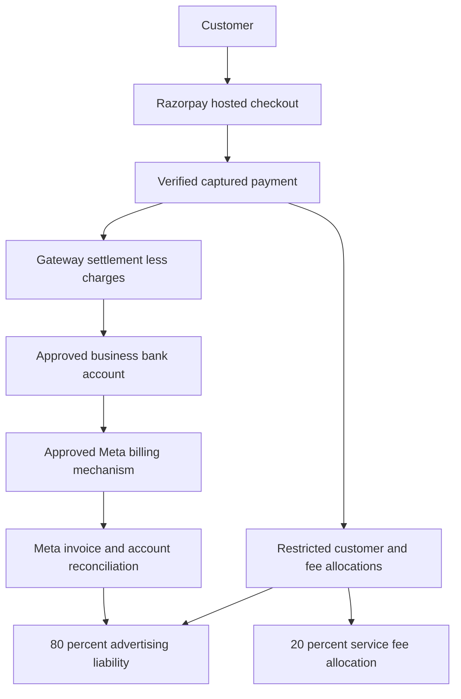

# Customer Payments and Managed Advertising

Status: design and local foundations only. Date: 2026-09-24.
No checkout, payment collection, bank transfer, Meta funding, account creation,
production migration, or deployment is enabled by this work.

## 1. Goal and Decisions

Collect customer payments in India/INR, allocate 20% to AdBrain's service fee
and 80% to advertising, and reconcile both against actual money movement.
The owner also requested investigation of creating customer ad accounts.

Confirmed by the owner: India/INR, managed advertising with one customer payment,
20/80 on the pre-tax package with gateway costs absorbed by AdBrain, and room to
change pricing later. AdBrain will legally operate under Solaride Energy. Tax
treatment still requires CA review. Owner-provided Meta screenshots show Solaride's
business portfolio as Verified and an ad-account creation limit of 3; that is not
proof of unused slots, API permissions or approved agency billing. Solaride 101 is
shown as owned by Solaride with INR currency and no saved payment method. Its
displayed account ID differs from the earlier prepaid billing screenshot, so the
earlier balance must not be attributed to Solaride 101. Actual automated funding
eligibility remains unverified. Razorpay is recommended, not yet onboarded or
provider-approved. No address, tax ID or contact details from screenshots are
needed in this document.

| Decision | Recommendation | Required before live use |
| --- | --- | --- |
| Legal entity | Owner-confirmed: Solaride Energy operates AdBrain | Gateway KYC, settlement account and invoices must use the legally appropriate Solaride details |
| Gateway | Razorpay Standard Checkout; evaluate Cashfree if onboarding/use-case approval fails | Merchant KYC, business-model approval, settlement bank verification |
| Pricing | Owner-approved: split the pre-tax package base 20/80; quote applicable tax separately | Indian CA-reviewed tax/invoicing policy |
| Gateway costs | Absorb in AdBrain's economics; never silently subtract from the advertised 80% | Confirm pricing remains viable after fees, fee taxes, refunds and disputes |
| Funds model | Owner-selected: managed advertising service with a restricted customer advertising liability | Gateway and legal review; not an unlicensed wallet or arbitrary money forwarding service |
| Meta assets | Owner-selected: Solaride-owned, separate ad account per customer | Disclose agency ownership, customer access and offboarding terms; verify account capacity and funding eligibility |
| Account provisioning | Optional, eligibility-gated; existing-account connection stays available | App access/permissions, portfolio eligibility, customer consent |
| Initial launch | One-time customer INR payments; Meta may charge Solaride automatically through a verified method | Refund policy, reconciliation, support and capped pilot approval; no recurring customer charges |

### Example and accounting boundaries

For a pre-tax INR 10,000 package: INR 2,000 fee allocation + INR 8,000 ad allocation.
Applicable customer tax is additional; the payable total is not necessarily INR
10,000. If the customer instead means INR 10,000 all-inclusive, pricing must be
re-derived after the approved tax policy, not silently treated as the same quote.
Do not assume GST applies only to the fee: principal/agent treatment, advertising
resale, place of supply, tax registration, withholding and input credits need CA
review. Meta invoice taxes must be accounted for explicitly without double-counting.
Decide whether the 80% promises net media spend or tax-inclusive Meta costs before
checkout. Current code labels it an allocation, not delivered spend.

20% of the package is a 25% fee relative to its 80% ad allocation. It is not the
same as adding a 20% markup to a customer's chosen advertising budget.

Use integer paise only. Fee = floor(base paise / 5); advertising receives the
remainder. Preserve the versioned quote for all later reconciliation. Gateway
fees are an AdBrain expense, not a change to the original quote. Allocation is
neither earned revenue nor a bank payout: revenue recognition and owner withdrawal
must wait for the agreed service, tax, refund and reserve policy.

### First package proposal and economics

Recommendation for owner/CA review, not an approved customer offer: INR 10,000
pre-tax for one business, one current offer, one service area, up to two creative
variants and one capped lead campaign with a closing spend/enquiry report. Use
the existing instant-form destination for the first Solaride test unless the
owner explicitly chooses another destination. Campaign duration and media limits
must fit the reviewed allocation; no guaranteed enquiries or sales.

Recommend defining the INR 8,000 advertising allocation as Meta costs including
applicable Meta tax, with net media and tax itemized. This interpretation is NOT
yet owner-approved. Do not describe it as INR 8,000 delivered media, deduct gateway
fees from it, or enable checkout before CA/gateway approval and funding proof.

Illustrative cash sensitivity only: assume 18% customer tax on the full base,
18% Meta tax, and a gateway charge of 2% plus 18% tax on that charge. These are
scenario inputs, not verified tax treatment or a negotiated provider quote.

| INR 10,000 base scenario | Cash amount (INR) |
| --- | ---: |
| Customer total under the illustrative tax assumption | 11,800.00 |
| Service allocation | 2,000.00 |
| Gateway cash cost on the customer total | 278.48 |
| Net media within a tax-inclusive INR 8,000 Meta allocation | 6,779.66 |
| Service cash remaining before delivery costs, with tax-inclusive Meta allocation | 1,721.52 |
| Cash remaining if INR 8,000 net media is promised and Meta tax is funded from the fee | 281.52 |

The comparison excludes input-tax-credit recovery, fixed overhead, refunds and
disputes; it is not an accounting profit calculation. At a proposed 10% of base
cash-contribution target, the tax-inclusive scenario permits at most INR 721.52
of generation, support and other variable delivery costs before reserve expenses.
Measure real operator time and generation cost in the pilot. If those costs exceed
the ceiling, revise package size/scope or propose a new fee version before selling.

Proposed refund principle for review: no ad delivery before cleared funding and
explicit approval; return unspent advertising allocation after final Meta charges
are reconciled, and refund unearned service amounts under disclosed milestones.
Do not promise instant refunds of money already loaded into a Meta account. Exact
milestones, refund timing, dispute handling and gateway terms remain launch gates.

### Changing pricing later

The implementation accepts an explicit versioned server policy in basis points
(20% = 2,000 of 10,000). General fee calculation is
`floor(basePaise * platformFeeBps / 10000)` with exact integer intermediates.
Every quote snapshots its version, rate, allocations, tax and total. Add a new
immutable policy version for a new rate; never edit the meaning of an existing
version or recalculate an accepted order/refund using today's rate. A future
database policy registry must enforce that immutability, activation/effective
time, permitted tenant overrides and privileged audit. Browser clients must not
choose a policy or fee rate. Expired unpaid quotes require explicit repricing
and renewed customer acceptance; paid orders keep their original terms.
Tax-inclusive pricing, tax rules or fee-cost policy changes also require a new
approved quote schema/policy, not just a rate update.

## 2. How Money Actually Moves

Do not implement a fictitious transfer-to-Meta API. Standard gateway settlement
normally reaches the merchant's bank net of charges; our ledger reserves the
advertising share. Paying Meta is a separate approved process via the account's
supported billing method or an approved invoicing/credit arrangement. Its timing
need not match an individual customer's checkout.

Razorpay Route transfers to onboarded Linked Accounts and has eligibility and
use-case requirements. It does not establish that Meta is a supported recipient.
Do not create a linked account using Meta's identity or bank details. Route is
not part of this initial design unless both providers explicitly approve it.

### Supported models to decide between

1. **Customer pays Meta directly:** easiest separation. AdBrain collects only its
   service fee; Meta collects advertising money. This does NOT meet the requested
   single-payment 20/80 flow and requires an explicit product decision.
2. **AdBrain-managed billing:** customer buys an advertising service; AdBrain
   reserves funds and pays Meta through an approved mechanism. Best match for one
   payment, but AdBrain bears settlement timing, chargeback and overspend risks.
   Customer-owned versus agency-owned assets remains a separate decision.
3. **Approved Meta invoicing/credit:** useful later for eligible businesses.
   API credit allocation is not a deposit of gateway funds. Credit eligibility,
   repayment liability and account compatibility must be verified first.

The gateway, bank, and legal reviewer must accept the chosen funds flow before
we collect real money. Do not pool unapproved customer funds or use one customer's
balance to cover another's campaigns. Maintain an operational reserve separately.

### Funding-first implementation priority (owner request)

The owner now prioritizes secure Solaride/AdBrain-to-Meta funding before customer
checkout, and asks for new-customer account provisioning alongside it. This changes
the delivery order: resolve the supported outbound funding mechanism first, then
build its durable operations and provisioning prerequisite checks; defer checkout.
The owner explicitly requires automatic money movement; operator-assisted payment
is not an accepted substitute. New customer ad accounts should be Solaride-owned,
one per customer. These requirements supersede the earlier customer-owned account
recommendation and proposed operator-assisted pilot.

Public Meta documentation establishes automatic payment options in India. Support
confirmation is not required merely to establish that these options exist. Actual
bank/recurring-method eligibility and setup still need verification. The September
24 live billing check confirms Solaride 101 uses available funds in INR, making
UPI auto-reload the candidate route. No recurring mandate has been authorised.

| Route | Automatic movement | Remaining prerequisites |
| --- | --- | --- |
| UPI auto-reload | Meta replenishes an available-funds account when its balance reaches the configured threshold | Eligible India account and UPI instrument; one-time authorisation in Meta and the UPI app; verified reload amount, threshold and provider limits |
| Automatic card billing | Meta charges eligible cards at billing thresholds and the monthly bill date | Compatible billing mode and Indian bank/card; RBI-compliant recurring authorisation; settlement float and charge reconciliation |
| Monthly invoicing / credit | Credit allocation supports advertising but is not a cash payment | Meta eligibility, credit approval and a separately verified automatic invoice-payment mechanism; public direct-debit documentation does not establish India support |

### Live Solaride billing check: September 24

The owner-authenticated Meta billing page for Solaride 101 (account ending 2052)
showed INR 0.00 available funds, no saved payment method and no recent spending.
The page explicitly says it deducts from available funds as ads run and pauses
ads when funds run out. This confirms the account's billing mode, not recurring
payment eligibility. Meta's displayed daily spending limit is not a customer
allocation cap or an AdBrain-configured account spending limit.

Both payment selectors offer UPI. Add payment method led to an empty Add to balance
amount form. Add funds offered cards, UPI and net banking, and prefilled INR 96,150
as its current maximum. That amount was cleared; it was not an approved top-up.
With UPI selected and the amount empty, no Save UPI checkbox or auto-reload setting
was visible. No amount was submitted during that initial inspection. The balance's
More options menu offered only View history. This does not prove auto-reload is
unavailable: its enrollment may occur later in the funding flow.

The owner subsequently approved entering INR 100 and inspecting the next screen
only, explicitly excluding payment, mandate authorization and ad activation.
The Other amount option and UPI selection were verified before advancing. Meta
accepted INR 100 within its displayed INR 40 to INR 96,150 range and generated an
unpaid, expiring UPI QR payment request. The Complete payment screen offered no
Save UPI or recurring authorization option. No QR was scanned, payment authorized
or bank details entered. The flow was left without paying. A fresh billing reload
confirmed no open payment dialog, INR 0.00, no saved methods and no recent spending.
Closing the dialog is not evidence that the unpaid request was cancelled; it had
an expiry. Do not pay it later under this inspection-only approval.

Next account-specific question for Meta: Solaride 101 is an India/INR available-
funds account, but Add funds > UPI goes directly to a one-off QR request without
Save UPI for recurring charges. Is UPI auto-reload enabled for this account, and
what exact eligibility or enrollment prerequisite is missing? The public setup
article alone does not answer this account-specific discrepancy. Do not fund the
account merely to assume that a recurring option will appear after payment.

The owner clicked Next Step in the support form, which displayed Meta's Beta
Product Testing terms, AI terms and Privacy Policy. After supplying the direct
account URL and selecting Solaride 101 explicitly, a support chat was opened using
the existing contact email, with the optional phone field blank. The assistant
identified itself as automated assistance for the owner and requested guidance
only, with no billing, payment, mandate or ad changes authorized.

The AI-enabled support chat reported that this account is eligible for auto-reload
but needs a saved primary payment method first. That is a support statement, not
observed recurring enrollment or a verified bank mandate. Its follow-up claimed
that an initial payment is required, but also said Save UPI must be selected before
payment and that paying a one-off QR alone likely would not save a recurring method.
It said a card is not required. These statements do not explain the missing option
or establish that a manual top-up will unlock it; do not pay merely to test that
assumption.

Asked to diagnose the discrepancy, the automated support agent said its tools and
documentation could not do so. Human billing escalation was requested, but it said
no specialist was available. It also could not provide a case/reference number or
support-inbox link. It acknowledged the issue as unresolved and said the conversation
is automatically saved; no independently verified escalation ticket was obtained.
The chat remains open for the owner. No payment, mandate or account change was
authorized or performed during the support conversation. The next required evidence
is a usable recurring-UPI enrollment path, or a separately verified compatible
automatic-billing route, not another generic setup article or ordinary top-up.

Meta's [setup instructions](https://www.facebook.com/business/help/791384133101786)
specify Add funds, an amount and UPI, then Save UPI for future recurring charges,
authorization in the external UPI app, followed by reload amount and balance
threshold settings. Inspect further only with an explicitly approved initial
amount and scope. The owner must handle bank authorization directly. Stop if the
flow offers only a one-off payment; a successful manual top-up would not satisfy
the automatic-funding requirement. Do not substitute prepaid card auto-reload,
which Meta's [supported methods](https://www.facebook.com/business/help/333798826401061)
exclude in India.

All five campaign toggles were Off during the same inspection. Two other ad sets
were On beneath Off campaigns. Recheck delivery state immediately before any
authorized funding, leave unpublished drafts untouched, and obtain separate ad
activation approval. No initial deposit, mandate, reload amount or threshold is
approved by the owner's earlier acceptance of the automatic-payment product model.

### Automatic funding boundaries

India UPI auto-reload is distinct from recurring card billing. Meta's prepaid
card auto-reload documentation excludes India; eligible postpaid recurring card
billing is supported. Do not infer that an existing prepaid account can be
converted, or that hybrid billing is available to every account. The local UPI
assessment conservatively requires available-funds mode until hybrid auto-reload
compatibility is separately established. Provider limits and eligible banks can
change; do not hardcode a permanent bank list or transaction ceiling.

**Automatic payments are not an exact 80% checkout transfer.** No documented public
API for arbitrary prepaid deposits or configuring auto-reload was found in the
reviewed references and SDK. That is a research result, not proof that no private
facility exists. `funding_id` selects a funding arrangement, not an amount to send.
Do not automate Ads Manager, store payment credentials/OTP, or invent a gateway
recipient. One-time mandate authorisation is different from repeated manual
top-ups. On 2026-09-24 the owner accepted one-time authorisation followed by
Meta-controlled recurring charges, with AdBrain tracking the customer's allocation.
An exact 80% deposit at checkout is not required under this accepted model. This
product decision does not authorise a bank mandate, payment, account creation or
ad activation. Actual account/method eligibility and authorisation remain gates.
Repeated operator-assisted top-ups remain outside the approved product scope.

**Spending and cash must remain separate.** Available-funds accounts cannot set a
Meta ad-account spending limit. Auto-reload can deposit more than the customer's
remaining allocation and leave unused prepaid funds. Campaign budgets, atomic
ledger reservations, delayed-spend reconciliation and pause monitoring must work
together; none is a promise of a real-time hard cap. Postpaid billing requires
treasury reserves for charges before gateway settlement, taxes, disputes and
refunds. Never assume a credited balance equals available customer entitlement.

For Meta-initiated charges, persist the verified billing configuration and ingest
provider charge/invoice evidence. Record observed charges independently of local
funding requests: Meta can initiate a charge without an AdBrain request. Dedupe by
provider/account/environment/reference, retain pending and ambiguous states, and
reconcile bank settlement, account, currency, taxes and customer attribution. Do
not retry or recreate a Meta-initiated charge from AdBrain. A funding-source ID,
screenshot, browser success flag or balance increase is not settlement evidence.

If a documented AdBrain-initiated payment adapter becomes available later, use
durable requests with `requested`, `approved`, `processing`,
`needs_reconciliation`, `confirmed`, `failed` and `cancelled` states. Reserve funds
atomically before processing, never blindly retry ambiguous outcomes, and release
only on definitive no-transfer failure/cancellation. Reconciliation overrides need
an identified reviewer and evidence, not an API-verified label. Prevent duplicate
reference reuse and concurrent refund/funding/withdrawal against the same money.

Next: select an acceptable route and onboarding model, verify it for an eligible
Solaride-owned account, then implement durable configuration, charge ingestion and
reconciliation in an isolated test environment. Support remains relevant for
limited-access programmes, credit approval or account-specific restrictions, not
as the sole path to researching automatic payments. Keep live actions disabled.

## 3. Can AdBrain Create Ad Accounts?

Yes, conditionally. Meta documents `POST /{business_id}/adaccount`, appropriate
Marketing API access and `business_management` permissions. Account limits,
business standing, asset roles and verification can block creation. Public docs
are not proof that this app/business is eligible. Current AdBrain uses Graph
v21.0 in capability verification; the public reference may display a newer
version. Verify support for the pinned version before implementing or upgrading.

Proposed onboarding:

1. Choose connect-existing or request-new; do not require a new account to pay.
2. Verify the customer's business identity, target portfolio ownership, consent,
   currency INR, timezone and real end advertiser. Show the legal owner clearly.
3. Check app access, granted scopes, administrator/asset roles, business standing
   and remaining creation allowance. Unknown or exhausted capacity blocks automated
   provisioning; an existing eligible account remains a separate connection path.
4. Persist a server-owned provisioning request before any provider mutation.
5. Create only on explicit confirmation. Store returned account ID immediately;
   on timeout/ambiguous response reconcile, never blindly retry a create.
6. Verify customer access, Page permissions and the billing arrangement separately.
   An account ID or `funding_source_details.id` is not proof of a funded balance.
7. Show ready only after account and funding verification. Keep campaigns PAUSED
   until separate activation checks pass. No automatic campaign launch after pay.

The owner selected Solaride ownership, one account per customer. Agency ownership
needs a clear contract covering access, liability, offboarding and data export;
do not promise ownership transfer is possible. Existing Solaride advertising must
not be mixed with unrelated customers. The displayed creation limit of 3 is a
capacity constraint, not proof of three available slots; check actual allowance
before every request and obtain an approved increase before scaling. Never create
accounts or portfolios to evade restrictions or quotas.
New-account creation is a later provider-gated phase, not a prerequisite we can
promise unconditionally during checkout.

Meta explicitly documents the marketing-partner-owned ad account / customer-owned
Page model. Its two-tier Business Manager solution also describes platforms paying
for client advertising, but is limited-access and requires credit prerequisites.
Neither pattern proves Solaride is enrolled, permits quota evasion or guarantees
unattended payment-method onboarding. Preserve customer Page consent and accurate
end-advertiser identity even where Solaride owns the ad account.

## 4. Repository Integration and Data Design

Existing `src/lib/campaign/spend.ts` evaluates weekly budgets and reporting
snapshots; it is not a cash ledger or prepaid-balance enforcement mechanism.
Keep its protections and add funding checks alongside them. Current Meta
capability verification remains authoritative for permissions, not money.

Data design: billing profiles, funding evidence, revocations and observed charge
events now have local, unapplied migrations. Other tables below remain planned.
No production migration or payment workflow is enabled.

| Table | Purpose and critical constraints |
| --- | --- |
| billing_profiles | Tenant, legal details, invoice identity, approved funds model and tax-policy version |
| payment_orders | Tenant, immutable quote, environment/provider account, unique local idempotency key, unique provider order ID |
| payment_attempts | Unique provider payment ID, expected order binding, captured amount, independent refunds/disputes |
| payment_events | Durable inbox, unique provider/environment/account/event ID, payload hash, processing state |
| ledger_transactions / ledger_entries | Append-only balanced postings, unique business-event key, tenant and currency invariants |
| campaign_funding_reservations | Atomic available-to-reserved movements, campaign/account binding, expiry/release lifecycle |
| payment_refunds | Amount, frozen entitlement, provider refund ID, unique request key, pending/processed/failed state |
| payment_settlements | Provider settlement ID, fees/taxes, adjustments and bank match |
| meta_billing_profiles | Implemented locally: immutable tenant/account/portfolio/environment assignment, one account per customer and one customer per account within an environment; no credentials |
| meta_funding_evidence / meta_funding_revocations | Implemented locally: append-only account-bound setup snapshots, reviewer/source references, verification/expiry and separate irrevocable revocation records; service-only access |
| meta_billing_events / meta_billing_event_conflicts | Implemented locally: immutable charge observations, unique profile/event reference, transactional duplicate detection and durable conflicts; no local transfer request required. Invoice/bank matching remains planned |
| funding_operations | Future documented AdBrain-initiated adapter requests only; separate from observed Meta charges, no synthetic transfers |
| ad_account_provisioning | Consent, target portfolio, dedupe key, returned account ID, ambiguous-outcome handling |

All money fields: checked nonnegative integer minor units unless an explicit
debit/credit entry uses a signed amount. Database totals must also reject overflow.
Tenant read access uses RLS; financial writes and posting RPCs are server-only,
with fixed search paths, least-privilege grants, actor and tenant checks. Derive
tenant/account identity from authenticated ownership, never trusted client notes.
No raw card details, CVV, provider secrets, full webhook PII or tokens in logs.

Ledger example at capture (pre-tax INR 10,000): debit gateway receivable 10,000;
credit customer advertising liability 8,000; credit deferred service fees 2,000.
Tax adds its separately approved liability. Settlement clears the receivable to
bank and gateway expenses. Delivery, revenue recognition, Meta payment and refunds
use separate balanced postings. Reserve/available are customer-liability subledgers,
not additional money. Recognition details require accountant approval.

## 5. Payment Protocol

1. Authenticate, resolve tenant, rate-limit and validate amount limits. Verify the
   approved billing profile and funding route before offering managed checkout.
2. Compute an immutable server quote from an approved tax policy. Client sends
   intent, not fee, tax, allocation, destination account or provider credentials.
3. Persist local intent and idempotency key before creating a Razorpay order with
   partial payments disabled. Do not assume provider order creation is idempotent;
   ambiguous timeouts require reconciliation, not blind creation of another order.
4. Open hosted checkout using server-returned order ID and public key only. CSP
   changes must be narrowly scoped to documented checkout endpoints and tested.
5. Treat browser success as pending verification. Verify callback HMAC against the
   stored order ID, then verify captured payment/order, amount, currency, merchant
   environment and tenant binding server-side. Signature alone grants no balance.
6. Verify webhook signature over raw bytes before JSON parsing. Bound body size,
   durably store the event, then acknowledge. Reject mismatched merchant accounts.
   Use separate test/live secrets; handle rotation without logging secrets.
7. Process captures once in a database transaction with order/payment uniqueness
   and ledger event uniqueness. Event dedupe alone is insufficient because different
   event IDs can describe the same capture. Never credit from authorization alone.
8. Handle duplicates and out-of-order capture/refund/dispute events; independent
   adjustments must not be erased by a late capture event. Persist unmatched events
   for reconciliation rather than inventing a tenant/order from webhook notes.
9. Periodically reconcile gateway API state, local ledger, settlements/bank and
   Meta invoice/spend evidence. Surface mismatches to an operator; fail closed on
   stale/unverified funding. Recovery must survive process restart and replay.

Payment, settlement, funding and campaign activation are distinct states. A paid
order remains paid after a refund in Razorpay; never derive refundable balance
from order status alone. Pending/failed/abandoned checkout has zero spend authority.

## 6. Funding, Activation and Refund Safety

- Atomically reserve funds before activation or any budget increase; concurrent
  requests cannot each spend the same balance. Re-check at execution, including
  resumed worker actions and direct API paths. Never replace existing spend caps.
- Daily budget times seven and delayed Insights totals cannot guarantee a prepaid
  hard cap. Use supported provider-side lifetime/account limits, a delivery-lag
  reserve, verified campaign end times and frequent reconciliation. Quantify the
  residual overspend risk in the pilot; AdBrain needs its own reserve.
- Include campaigns changed directly in Ads Manager; customer access can invalidate
  limits. Detect drift and stop new activation. Failed pauses/unknown provider
  outcomes are incidents, not released reservations.
- Never mark money sent to Meta solely because an internal allocation was made.
  UI distinguishes pending payment, allocated, reserved, delivered and reconciled.
- Refund request freezes the refundable amount atomically. Pause affected delivery,
  reconcile late spend, calculate unused funds and fee entitlement under accepted
  terms, then issue the provider refund. Completion requires provider evidence.
- Full refund before delivery is the recommended initial policy; partial fee
  earning/refunds and tax credit notes need explicit approved rules. No automatic
  promise that spent funds or gateway charges are recoverable from Meta/provider.
- Concurrent refund and activation must serialize. Disputes freeze affected funds
  and restrict activation; do not hide deficits by clamping accounting balances.
- Outbound bank withdrawal of fees requires earned revenue, reconciled cash and
  adequate tax/refund/dispute reserves. Do not automatically sweep 20% at capture.

## 7. Customer and Operator Experience

Customer Billing under the existing workspace: transparent package breakdown,
tax/invoice details, hosted Pay action, pending/retry/recovery states, receipts,
available/reserved/spent ad allocation and refund status. Never call the allocation
a Meta wallet balance. Payment success does not say the campaign is live.

Create/activation: show the required reservation, selected Meta account and a
clear insufficient-funds or funding-unverified result. Existing unpaid/draft
customers are not silently charged or migrated to managed billing.

Operator tools: unreconciled payments, webhook backlog, settlements, outstanding
Meta liability, pending refunds/disputes, funding evidence and provisioning failures.
Sensitive manual adjustments require privileged actor, reason, audit trail and
approval policy; edits to balances are forbidden.

## 8. Delivery Phases and Acceptance Gates

| Phase | Deliverable | Gate |
| --- | --- | --- |
| 0: funding feasibility | Choose UPI auto-reload or eligible automatic card billing; verify account model and onboarding | Owner accepted Meta-triggered timing and one-time setup on 2026-09-24; actual Solaride eligibility and mandate still unverified; invoice path stays gated |
| 1: local foundations | Versioned INR quote, offline signature checks, funding/provisioning assessments and read-only Settings | Exact allocation, fail-closed assessments, unknown ownership/capacity and connection regressions pass |
| 2: managed funding foundations | Durable billing profiles, observed charge inbox and reconciliation; provisioning orchestration | Isolated database, authenticated fresh evidence, consent, quota checks and ambiguous-outcome recovery; no unsupported transfer API |
| 3: durable ledger | Server-only posting RPCs, RLS, treasury/customer reservations and refund accounting | Fresh/upgrade PostgreSQL; tenant isolation, concurrent capture/refund/reservation, restart/replay and overspend tests |
| 4: Razorpay test checkout | Server orders, callbacks/webhooks, billing UI, receipts and refunds | Gateway-approved funds flow, CA-reviewed tax/refund terms, separate non-production database/test credentials; duplicate/out-of-order lifecycle |
| 5: funding/provisioning pilot verification | Explicitly authorised eligible account and instrument, end-to-end charge/settlement reconciliation | Real account permissions, mandate evidence, spending controls and failure recovery; setup assessments alone never satisfy this gate |
| 6: controlled live pilot | Allowlisted customers, low limits, daily reconciliation, monitored support | Explicit live approval, small payment/refund and funding pilot, exact deployment verification |
| 7: wider rollout | Gradual customer expansion, alerts, runbooks and operational reporting | Stable reconciliation and refund evidence; audited reserve/risk policy |

Implement phases 2 onward only after the relevant design decisions are approved;
test-mode credentials are supplied through the normal secret manager, never chat.
No production migrations, secret changes, real payments/refunds, account creation,
ad activation or deployment are authorized merely by writing this plan.

### Required automated coverage

- Money conservation, rounding, large/negative/fractional/NaN inputs and explicit tax.
- Callback/webhook tampering, raw-body changes, malformed signatures, missing secrets.
- Wrong order/amount/currency, merely authorized payments, partial or refunded captures.
- Authentication, CSRF/origin checks, tenant spoofing, stale quotes and rate limits.
- Concurrent idempotency keys, duplicate event IDs, different IDs for one capture,
  late refund/dispute before capture, unknown order, inbox retry after DB outage.
- Refund/activation races, post-pause late spend, ledger balancing and RLS.
- Checkout cancel/retry/reload and pending state, CSP, mobile UPI return and
  accessibility in Chromium/WebKit; no live provider claims from mocked checks.
- All repository release gates: lint, types, coverage, audit, local PostgreSQL and
  build; exact main CI/deployment plus scoped production smoke on approved launch.

### Operations and rollback

Independent server-side gates for checkout, funding, activation and provisioning;
default off with per-tenant pilot allowlists. Disabling checkout must NOT disable
webhook ingestion, refunds or reconciliation for already received money. Alert on
signature failures, duplicate conflicts, stuck captures/settlements/refunds, ledger
imbalance, negative liabilities, stale Meta spend and failed pauses. Page an operator
for money mismatches. Roll back code through a reviewed PR; never delete ledger
history or roll back captured money. Use compensating entries and approved refunds.

## 9. Implementation Receipt

Local only: `src/lib/payments/allocation.ts` and its tests implement the owner-approved
pre-tax INR allocation with immutable quote snapshots and a replaceable versioned
rate policy. Tax is a required explicit input; no default GST assumption.
This helper is not a checkout service or a tax engine and has no runtime callers.
`src/lib/payments/razorpay-verification.ts` implements offline callback/raw-webhook
HMAC checks using Node crypto plus captured-payment shape/order/amount validation.
These are independent checks, not proof of payment on untrusted caller data.
Future callers must supply authenticated provider evidence and a server-owned order,
verify merchant/environment/tenant binding, and post through an idempotent database
transaction. A valid signature has no replay protection without the durable inbox.
Refunded or incomplete captures fail the initial-capture helper and require the
reconciliation path; they must not be silently discarded by a future webhook route.
The payment helpers are local foundations, not production payment functionality.

`src/lib/payments/meta-funding.ts` adds the India funding catalogue and pure funding
and account-provisioning setup assessments. They validate input and fail closed for
unknown ownership, mode, mandate, timing acceptance, spend controls, API access,
consent or remaining capacity. Monthly invoicing cannot pass the India automatic
payment check. Setup readiness is diagnostic only: all execution permissions stay
false even for fully verified fixtures. The raw setup assessments do not authenticate
the supplied evidence or reserve Meta account-creation slots. The recorded-evidence
assessment additionally binds tenant, environment, account, expected Solaride
portfolio and connection generation, and checks expiry, revocation, future timestamps
and a mandatory server-supplied maximum evidence age. Future callers must derive
that context from authenticated ownership, trusted configuration and a current
connection, not browser flags. `test` identifies isolated fixtures, not a promise
that Meta provides a payment sandbox. Never use test records for live eligibility.

`db/migrations/20260924_managed_billing.sql` implements local billing assignments,
append-only funding evidence and separate revocations. Unique constraints serialize
competing customer/account assignments. Owners may read only their profile, not
internal verification evidence. Anonymous/browser roles cannot mutate any billing
records; even the service role has no UPDATE/DELETE grants. Restrictive foreign keys
preserve history, so managed business/user deletion and account reassignment require
a later explicit retention/offboarding design, not a cascade or direct profile edit.
These local assignments do not reserve capacity or create accounts inside Meta.

The service-only `meta_funding_latest_record` RPC returns the most recently verified
snapshot, not the last-arriving one, and overlays revocations for the profile.
Delayed pre-revocation snapshots cannot clear a hold; restoring eligibility requires
fresh evidence verified after revocation. Read `meta_funding_latest_record`, not a
raw evidence row: the original snapshot intentionally remains unchanged. Evidence
references identify separately retained source artifacts; a UUID or an operator
label alone does not prove a provider fact. No source collection/validation adapter
has been implemented, and no credential, card number or OTP belongs in these records.

`src/lib/payments/meta-funding-store.ts` provides a typed server reader, validates
context before database access, returns only the assessment, and distinguishes
missing evidence from storage failure. Database errors and malformed or mismatched
records fail closed. It has no application-workflow callers yet; Settings does not
query the unapplied schema. Future execution must recheck eligibility in its own
transaction/workflow; a diagnostic read is not a financial authorization or a lock.

The existing disposable PostgreSQL harness exercises both fresh and ordered-upgrade
paths, repeated migration application, role privileges, tenant isolation, concurrent
assignments, record/account binding, test/live separation and revocation ordering.
It launches and removes its own socket-only cluster and never loads production
credentials. These checks do not establish real Meta mandate or billing eligibility.

`src/lib/payments/meta-billing-events.ts` defines an internal charge-observation
format, not a claimed Meta webhook/API contract. Events bind tenant, environment,
account and charge reference; positive integer INR amounts are checked exactly.
`amountPaise` is the total observed charge; `taxPaise` is its included tax component
when known, or null when unknown. Null is not zero and must not be filled from a
guessed GST rate. The raw-payload SHA-256 is an integrity/deduplication field, not
authentication. A future adapter must verify the source, derive identity from
trusted account mapping, map documented provider statuses and use stable namespaced
event/charge references before calling the storage helper. Synthetic references
or screenshots are not evidence that Meta actually moved money.

`db/migrations/20260924_meta_billing_events.sql` follows the managed-billing migration.
Only its service-role RPC can insert events or conflicts. Ingestion locks the billing
profile and atomically returns `recorded`, `duplicate` or `conflict`. An identical
retry has no additional effect. Reusing an event reference with different content
preserves the original and stores the distinct conflict once. No direct service or
browser UPDATE/DELETE/INSERT grants permit bypassing this ingestion protocol.
Changing the charge reference on an existing event marks both charges as conflicted.
Artifacts referenced by source UUID must be retained separately; never store raw
payment credentials or full provider payloads in these normalized records.

The server helpers in `meta-funding-store.ts` reject malformed/mismatched inputs
before storage, separate missing evidence from storage failure, and preserve a
durable conflict when assessing the original event. Reads over 1,000 observations
fail closed rather than treating a truncated set as complete. A successful observed
charge remains `awaiting_settlement`; pending observations cannot downgrade it,
and repeated success events for one charge are never summed. Amount/tax/status
conflicts and reversals require reconciliation. Failed charges never authorize an
AdBrain retry. These assessments cannot credit customer balances, activate ads,
retry charges or establish bank settlement.

A timeout/error during ingestion is `unavailable`, not acknowledgement of success.
Retrying the same internal observation is safe through the deduplication RPC; this
does not authorize retrying the actual provider payment. Conflicts remain held:
resolution, bank/invoice matching, ledger posting, partial refunds, chargebacks,
event-source collection and customer-facing billing history are not implemented.
There is no public ingestion endpoint or active poller/webhook, and Settings does
not call these helpers. PostgreSQL tests cover concurrent duplicate delivery,
conflict replay, preserved originals, scope/currency/amount checks and role denial.

Settings now includes a read-only Managed billing section using the catalogue and
versioned default allocation. Connection identity is shown separately from funding
verification; all managed billing remains explicitly not enabled. Method details
link to official requirements; expanding them does not select or save a method.
No existing customer is enrolled or moved to Solaride ownership. Existing Meta
activation checks and PAUSED publishing behaviour are unchanged. The assessment
functions have no live decision-making callers yet; only the catalogue is rendered.

## 10. Primary References

Consulted 2026-09-24; provider documentation and eligibility can change.

- [Meta Business Manager API](https://developers.facebook.com/docs/marketing-api/businessmanager/)
- [Meta account creation reference](https://developers.facebook.com/docs/marketing-api/reference/business/adaccount/)
- [Meta requirements and invoicing](https://developers.facebook.com/docs/business-management-apis/business-manager/get-started)
- [India UPI and other country auto-reload methods](https://www.facebook.com/business/help/333798826401061)
- [UPI auto-reload setup](https://www.facebook.com/business/help/791384133101786)
- [India recurring card billing](https://www.facebook.com/business/help/3536169639844756)
- [Hybrid billing availability](https://www.facebook.com/business/help/1730009227245741)
- [Account spending limit restrictions](https://www.facebook.com/business/help/141820733085330)
- [Monthly invoicing and payment methods](https://www.facebook.com/business/help/2086865811541431)
- [Marketing-partner ownership model](https://developers.facebook.com/docs/business-management-apis/business-manager/best-practices)
- [Limited-access two-tier solution](https://developers.facebook.com/docs/business-management-apis/2tier-bm-solution)
- [Two-tier prerequisites](https://developers.facebook.com/docs/business-management-apis/2tier-bm-solution/prerequisites)
- [Razorpay Standard Checkout](https://razorpay.com/docs/payments/payment-gateway/web-integration/standard/integration-steps/)
- [Razorpay webhook signatures, duplicates and ordering](https://razorpay.com/docs/webhooks/validate-test/)
- [Razorpay Route and Linked Account eligibility](https://razorpay.com/docs/payments/route/)

These sources establish technical options, not AdBrain's approval to use them.