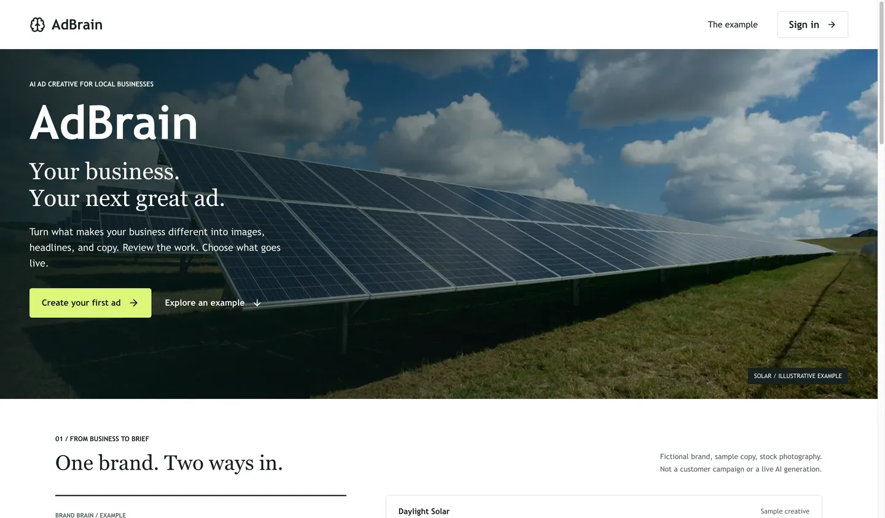
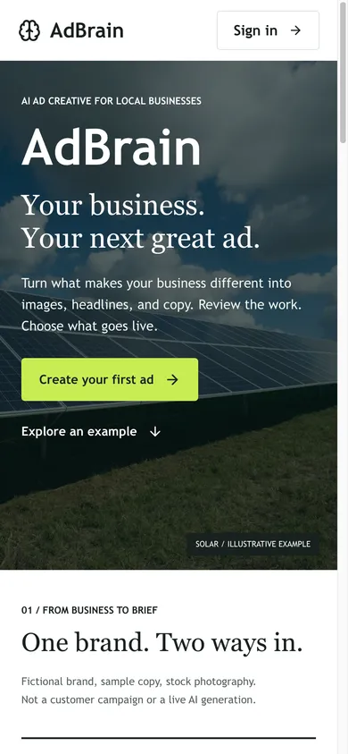

# Public Page Refresh

Validated locally on 2026-09-05 using the production Next.js build.

## Delivered

- Public-only CSS module; authenticated screens and data paths are unchanged.
- Photographic first viewport, explicit example label, and direct sign-in CTA.
- Fictional Daylight Solar brief with two selectable headline/copy/CTA variants.
- Native radio controls, keyboard navigation, skip link, and native FAQ disclosure.
- Review and paused-campaign guidance; no fabricated results or generation claims.
- Existing server auth redirect, FAQ JSON-LD, and legal navigation retained.

The photograph is by American Public Power Association, from
[Unsplash](https://unsplash.com/photos/2gDwlIim3Uw), downloaded from
`images.unsplash.com/photo-1509391366360-2e959784a276` and served locally as
`public/solar-example.jpg`. It is stock illustration, not a customer installation
or an AI-generated image. The fictional copy is not evidence of model quality.

## Checks

- `npm run lint`: passed.
- `npm run typecheck`: passed.
- `npm run test:coverage`: 71 files, 627 tests passed; all coverage gates passed.
- `npm run build`: passed, including after the final CSS stacking adjustment.
- Playwright on the built app: 1440, 1024, 768, and 390 actual CSS-pixel widths.
- No horizontal overflow; both images loaded; pointer and arrow-key angle
  selection updated the sample; FAQ disclosure opened; no page errors captured.
- Final 1440 and 390 screenshots rechecked after replacing negative hero stacking
  layers with explicit image/overlay/content layers. Both show the photograph.

The integrated browser had a 125% zoom setting. Requested viewport sizes were
adjusted and `innerWidth` asserted, rather than assuming the requested width was
the rendered CSS width. Screenshots below are resized to their CSS widths.

## Not Yet Accepted

This refresh is not the complete public-proof phase or a customer-readiness signoff.
Actual generated creative provenance, an inspected results/follow-up example,
first-run and populated authenticated workflows, and user-task evaluation remain
open. The completed ad example is below the first viewport, so the strict
first-viewport output-proof gate is not met yet.

An existing local authenticated session redirected to Dashboard and its data
requests were slow. Development mode also reported a CSP `unsafe-eval` warning.
Neither issue was diagnosed or changed in this public-only pass. Browser evidence
above comes from anonymous production-build requests, not the authenticated app.